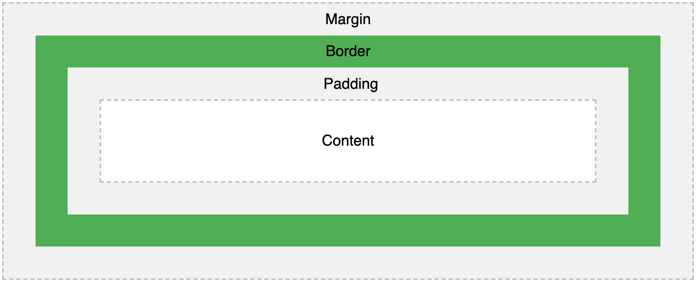
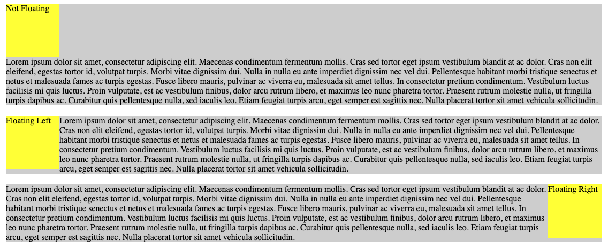
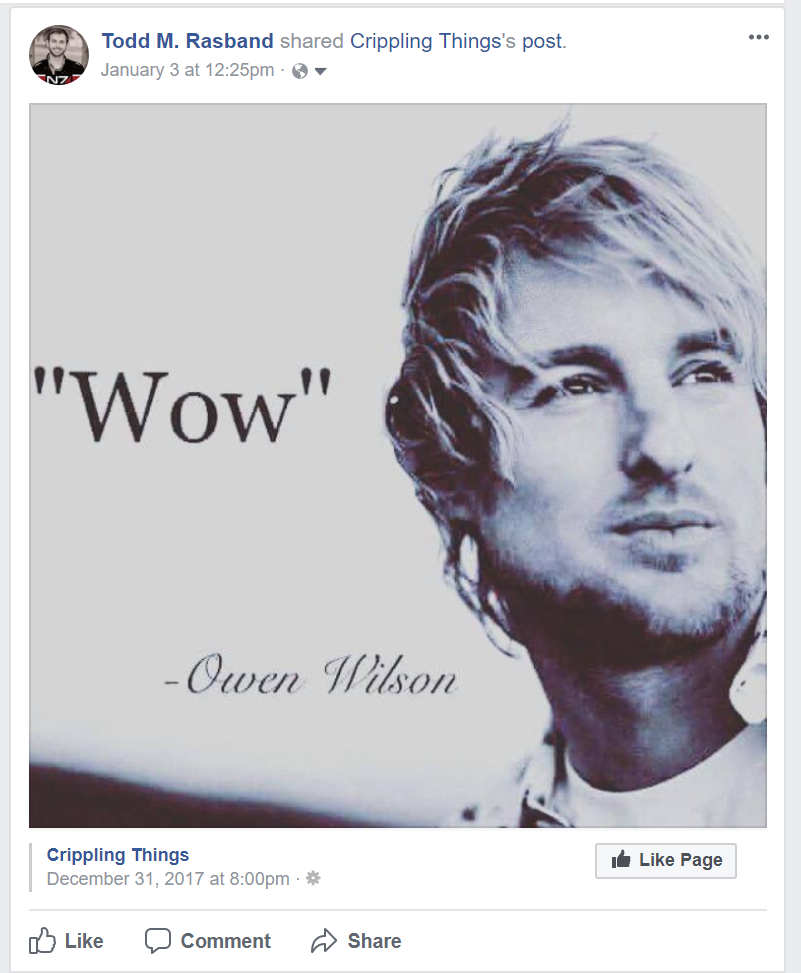
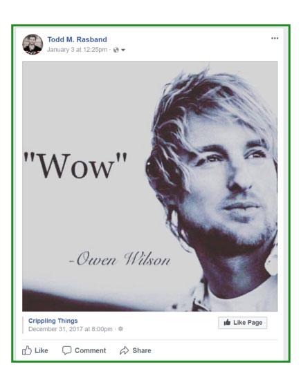
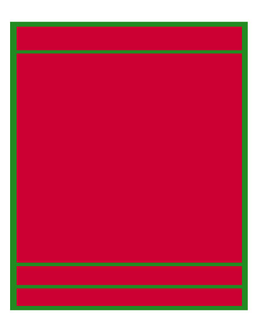
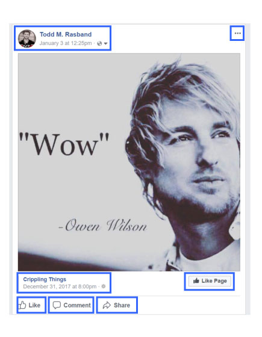
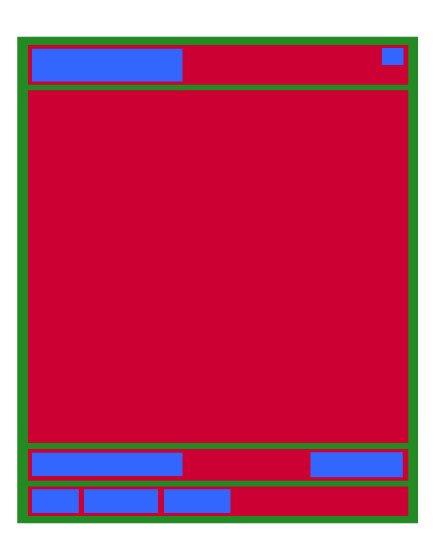
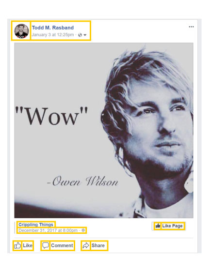
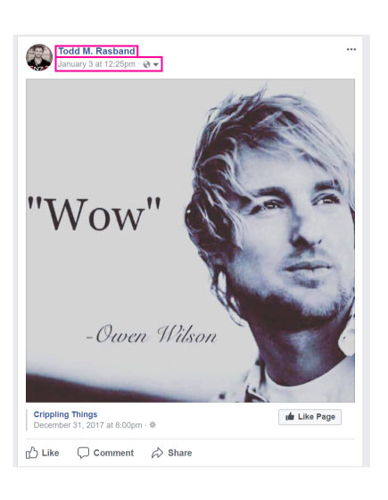
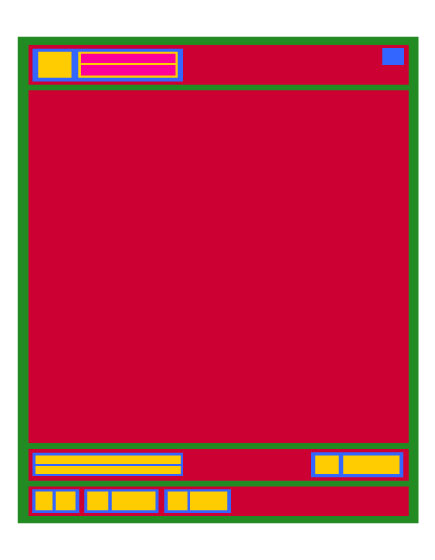

# Lesson Sections

Lecture Slides: https://slides.com/awestenskow/html-css-i#/

Afternoon Project: https://github.com/DevMountain/html-layout

1. [HTML/CSS 1 Lecture Notes](#HTMLCSS-1-Lecture-Notes)
   1. [HTML](#HTML)
   1. [CSS](#CSS)
   1. [Visualizing HTML/CSS](#Visualizing-HTMLCSS)
1. [Additional Resources](#additional-resources)
1. [HTML/CSS 1 Mini Project](#HTMLCSS-1-Mini-Project)
1. [HTML/CSS 1 Afternoon Project](#HTMLCSS-1-Afternoon-Project)

# Student Learning Objectives

<details>
    <summary>HTML</summary>
    
* Student can describe and create an HTML file (new)
* Student can use the head tag to insert meta information about the page
* Student can insert comments in HTML (new)
* Student can change the title and icon of their webpage (new)
* Student can use the body tag to specify what will be displayed
* Student can use div, p, h1-h6, and span tags to layout a flow of information
* Student can use ol, ul, and li tags
* Student can use nav, footer, and header tags
* Student can use img tags to bring in pictures
* Student can use a tags to route to another webpage
* Student can use link tags to bring in CSS files
* Student can use and describe inline, inline-block, and block level elements (new)
* Student can use the class and id attributes (new)
* Student can utilize and understand the benefits of semantic HTML (new)

</details>

<details>
    <summary>CSS</summary>

- Student can describe what CSS is
- Student can use CSS selectors (element, id, class) to style elements (new)
- Student can use CSS pseudo-classes to style elements (new)
- Student can can use group, descendant, child, and sibling combinators to style elements (new)
- Student can use the font, color, and background-color properties (new)
- Student can bring in and use a new font in a project
- Student can use text-align property
- Student can use background property to specify colors or images used for backgrounds
- Student can describe the box-model (new)
- Student can explain box-sizing: border-box (new)
- Student can use height, width, margin, padding, and box-sizing properties
- Student can describe the difference between px, %, vh/vw, em, and rem (new)
- Student can use the float property
- Student can use and describe a reset file
- Student can understand and utilize a mockup (new)
- Student can visualize HTML/CSS in terms of boxes/containers (new)

</details>

# HTML/CSS 1 Lecture Notes

<details open>
    <summary>Lecture Introduction</summary>
    
In this lecture we introduce HTML and CSS. HTML (HyperText Markup Language) and CSS (Cascading Style Sheets) are two of the building block languages of web applications, and they are considered "front-end" technologies. HTML gives content *structure* and *meaning* by defining the "elements" that the web page is made up of. CSS is a presentational language that is used for only for the *layout* and *styling* of a webpage. JavaScript, together with HTML and CSS, is responsible for bringing our websites to life.

Check out this visual analogy for what HTML, CSS, and JavaScript do respectively:


</details>

## HTML

HTML stands for Hyper Text Markup Language. HTML is used to create the infrastructure of a webpage. HTML is **NOT** a programming language; HTML is considered a "markup" language. HTML does not contain logic, and HTML elements contain very little, if any, native styling. HTML is simply used to specify the structure and basic parts of a page.

> Note: Over the years, there have been many versions of HTML. As of 2014, the most up-to-date version is HTML5, which introduced a number of new features to the language. For more details, see here: https://stackoverflow.com/questions/134727/whats-the-key-difference-between-html-4-and-html-5

### Set Up and Basics

<details>
    <summary>Information</summary>
    
#### Making an HTML File
    
HTML files are created by ending the name of a file with an `.html` extension. This extension tells browsers and code editors to read the file as HTML.

> Note: `index.html` is the standard name for a root HTML file since the browser looks for files called `index` by default.

#### HTML Syntax Overview

HTML is based around filling "tags" with "content" in order to create HTML "elements".

```html
<thisisatag>This is the content</thisisatag>
```

Above is the basic syntax of an HTML element.

1. First is the tag itself. HTML tags are declared using angle brackets `<>`, with the name for the tag contained within the `<>` brackets.
2. Most HTML tags come in pairs of opening and closing tags. The closing tag begins with a `/` immediately after the first angle bracket to indicate that it is corresponding closing pair of the HTML tag.
3. Between the angle brackets is where developers specify the type of tag they are using. There are various types of tags native to HTML, which will be covered shortly.
4. Tags are wrapped around the **content** that is stored inside that HTML tag. The content together with the tag creates an HTML element.

> Note: Some elements are called "self-closing" or "void" elements because their tags should not be written in pairs. This is because they are not designed to contain content. See the example below:

```html
<input />
```

> Notice that there is only one tag, and it uses a forward slash at the ending of the tag.

#### Comments in HTML

Comments can be written in HTML code to help clarify what's going on in the development environment. Comments will not appear in the browser, so they're not necessarily intended to be viewed by the users of a site. Comments are instead an excellent way to communicate with other developers, and even ourselves, about what's supposed to be going on in the code.

Comments begin with `<!--` and close with `-->`.

```html
<body>
  <!-- This is a comment that will not be displayed on the web page -->
</body>
```

#### Basic HTML Page Structure

Here's an example of a basic HTML page structure:

```html
<!DOCTYPE html>
<html lang="en">
  <head>
    <!-- Meta tags and other external links go here, and the link and title tags below can be used to change the icon/title of your webpage -->
    <link rel="shortcut icon" href="some-URL-or-path-goes-here" />
    <title>The Title</title>
  </head>
  <body>
    <!-- Content of page goes inside the body tag -->
  </body>
</html>
```

Now, let's break down the structure seen above.

`<!DOCTYPE html>` - This tag is pretty unique, and it's actually not an HTML element; it's an instruction to a web browser that lets it know what version of HTML to expect.

> Note: Always make sure that this is the first declaration in an HTML document, otherwise the page may not work.

`<html>` - The html tag tells the browser that everything contained inside the tag should be read as html. The `lang` "attribute" can be used to specify the human language that the contents are written in. This element will act as the root tag for the file, which means that everything will be contained inside of this tag.

`<head>` - The head tag is a container used to contain "metadata" (data about data). Metadata is what is used to define the title of the document, character set, and other details that are relevant for accessibility and SEO. Metadata is not displayed on the web page for the user.

`<title>` - This is a metadata tag that will contain the title of the document.

> Fun Fact: The title determines which words are displayed on the web page tab.

`<body>` - The body tag is the container for all the elements that will make up a web page. Everything inside of the body tag will be displayed on the web page. This is where developers will store elements such as divs, spans, hyperlinks, text, etc.

#### Meta Tags

Meta tags are used to provide information about a site that can be used by search engines and other software. Web crawlers and search engines use the metadata contained within meta tags to evaluate, rank, and sort through websites. Good usage of metatags can help optimize a site's ranking in search results.

> Note: Meta tags need to be placed inside the `<head>` tag of the file.

Below are some example Meta Tags:

```html
<head>
  <meta charset="UTF-8" />
  <!-- charset stands for character set, and this information is used so the web browser knows which characters, or alphabets, are being used. UTF-8 (Unicode) covers almost all of the characters and symbols used in the world. -->
  <meta name="description" content="best website ever made" />
  <!-- the description tag has a content attribute that dictates the primary description of your site as it appears in search engines -->
  <meta
    name="keywords"
    content="greatest, best, ultimate, GOAT, website, of all time"
  />
  <!-- keywords are used to help search engines recognize what search words can be used to point users toward a site-->
  <meta name="author" content="matias perez-ferrero" />
  <!-- the author tag serves to credit the creator of a website -->
  <meta name="viewport" content="width=device-width, initial-scale=1.0" />
  <!-- a browser viewport is the area of web page in which the content is visible to the user. The width attribute can be used to set a specific width in pixels of the intended display. Here it is set to a special value (“width= device-width”) which is the width of the device in terms of CSS pixels at a scale of 100%. The initial-scale property governs the zoom level when the page is loaded for the first time. -->
</head>
```

</details>

### Semantic HTML

Semantic HTML is HTML that introduces context or meaning to the structure of a webpage, instead of using elements simply for display. Appropriate usage of semantic HTML is critical for accessibility issues and Search Engine Optimization (SEO).

Examples of nonsemantic HTML: `<div>, <span>`

Examples of semantic HTML: `<footer>, <header>, <nav>, <form>, <table>, <article>, <main>, <section>`

<details>
    <summary>Semantic HTML Information</summary>

Notice how semantic tag names imply some significant meaning about their contents. Appropriate usage of semantic HTML can boost a site's SEO, and also enable screen reading softwares to work more effectively for people with disabilities.

When it comes to making your sites more accessible, here are three easy tips to follow:

1. Always use the semantic tag alternative if it's an option
1. Attach labels to each of your `<input />` elements
1. Use a `<button>` tag whenever you use an `onclick` event handler. For more reasons on why you should try to always use a button with an onclick, see here: https://blog.benmyers.dev/clickable-divs/

> Note: As of Oct. 2019, the Supreme Court has cleared the way for discrimination law suits against websites that are not accessible to people with disabilities. The Supreme Court let stand a ruling that the Americans With Disabilities act requires web pages to be equally accessible as any other utility to those with disabilities. This means that creating accessible websites will be legally mandatory in the near future. In light of this, be aware that chrome has developer tools that can help audit accessibility issues, and you can also add this extension that provides more advanced features for discovering accessibility issues: https://chrome.google.com/webstore/detail/axe-web-accessibility-tes/lhdoppojpmngadmnindnejefpokejbdd?hl=en-US

</details>

### Common Tags In HTML

There are many different tags that can be used to create HTML elements. Here, we will review the more commonly used HTML tags.

<details>
    <summary>Header Tags</summary>

The `<header>` tag is used as a container for introductory content or a set of navigational links.

Example:

```html
<header>
  
  <h1>Heading Title</h1>
  <nav>
    <ul>
      <li>Home</li>
      <li>About</li>
      <li>Contact</li>
    </ul>
  </nav>
</header>
```

> Note: Header tags cannot be placed within a `<footer>`, `<address>`, or another `<header>` element.

</details>

<details>
    <summary>Heading Tags</summary>

Heading tags are used to create headers for content on a webpage. Heading tags can come with built-in font size and weight variations corresponding to their level, depending on the browser. These can be removed with a reset CSS file, or customized by developers using their own stylesheets.

There are 6 levels of heading tags that are available for use. The lower the number of the heading is, the more important it is.

```html
<h1>Heading One</h1>
<h2>Heading Two</h2>
<h3>Heading Three</h3>
<h4>Heading Four</h4>
<h5>Heading Five</h5>
<h6>Heading Six</h6>
```

</details>

<details>
    <summary>Nav Tags</summary>
    
The `<nav>` tag defines a set of navigation links. Screen readers for disabled users can use the nav element to determine whether to omit the initial rendering of the content, which increases performance of the site and software.
>Note: Not all links of a document should be inside a `<nav>` element. The `<nav>` element is intended only for major blocks of navigation links.
</details>

<details>
    <summary>Paragraph Tags</summary>

The `<p>` tag can be used to declare that an element will be a paragraph.

```html
<p>Hey, I'm a paragraph!</p>
```

</details>

<details>
    <summary>Div and Section Tags</summary>

The `<div>` tag represents a division or a section within a web page. The `<div>` tag is not semantic, as it doesn't imply anything about the contents of the tag. Div tags are often used as a container, or wrapper, for other elements in order to arrange the inner elements or apply some javascript functionality.

```html
<div>
  <p>
    I'm using a div tag to create a division within my web page that "houses,"
    "wraps," or "contains" a paragraph tag
  </p>
</div>
```

A semantic alternative to the `<div>` tag is the `<section>` tag. It can be used the same way that one would use a `<div>` tag, but it implies that the content is a meaningful section of the web page.

```html
<section>
  <p>
    I'm using a section tag to create a semantic division within my web page
    that contains a paragraph tag
  </p>
</section>
```

</details>

<details>
    <summary>Span Tags</summary>

The `<span>` tag is used to group inline elements in the document. The span tag does not provide any visual changes on its own.

Span tags can be used, in conjuction with ids or classes, as a "hook" inside of another element to apply more specific styling or functionality to that content.

```html
<span>
  <p>
    I'm a <span id="different-styled-font">span</span> tag inside of a p tag
    inside of a span tag!
  </p>
</span>
```

</details>

<details>
    <summary>Separation Tags</summary>

There are a couple of tags that can be used to create space or separation between elements. These tags are `<hr>` and `<br>`.

- `<hr>` - this tag is used to create white space between elements
- `<br>` - this tag is used to insert a single line break between elements
  </details>

<details>
    <summary>List Tags</summary>

There are two kinds of lists that can be created in HTML. They are known as ordered, or unordered lists. Each type of list is comprised of list items.

`<ul>` - this is the tag used to create an unordered list

- This will create a list-like structure using bullet poiints

`<ol>` - this is the tag used to create an ordered list

- This will create a list-like structure using numbers

`<li>` - this is the tag used to indicate that the content is a part of the list. It is short for "list item."

Syntax:

```html
<!-- Unordered List -->
<ul>
  <li>About</li>
  <li>Contact</li>
</ul>

<!-- Ordered List -->
<ol>
  <li>About</li>
  <li>Contact</li>
</ol>
```

</details>

<details>
    <summary>Input Tags</summary>

`<input />` tags are used create input elements in HTML, and they are commonly used to collect user input.

Input tags can have a `type` attribute applied in order to control the type of input that will be inserted, and affect the default styling and behavior of the input field. There are many different `type` values of input fields including `button`, `checkbox`, `color`, `date`, `datetime-local`, `email`, `file`, `image`, `image`, `month`, `number`, `password`, `radio`, `submit`, and more.

If a `type` attribute value is not specified for an `<input>`, it will default to `type="text"`, which is just a normal input box a user can type any text into.

> Note: `<input />` tags are an example of one of the more commonly used "self-closing" or "void" elements in HTML. They should _NOT_ be written in pairs.

</details>

<details>
    <summary>Button Tags</summary>

Buttons are a great way to enable users to interact with a web page.

`<button>` - this is the tag used to create a button.

In order to make buttons or other elements interactive, an event handling attribute, like `onclick` would need to be added. Events will be covered in the near future, so don't worry too much about them for now. Here's an example of what a button might look like:

```html
<button onclick="someFunction()">Button Text</button>
```

</details>

<details>
    <summary>Image Tags</summary>

Images can be embedded into a web page using the `` tag.

The `src` attribute is necessary to specify the source of the image shown. It can point to a relative path, or be a URL to some external source.

Image elements can also use an `alt` attribute to create text that will display if the image source can't be loaded. Including descriptive `alt` tags is another way to enable a better experience for users with disabilities, as screen readers can read out the alt tag for visually impaired users.

```html

```

</details>

<details>
    <summary>Anchor Tags</summary>
    
Anchor tags are used to define the beginning and end of a hypertext link. Anchor tags can be used to redirect users to external links by specifying the destination with the `href` attribute. They can also enable users to jump to specific points on the same page using the `name` attribue.

```html
<a href="http://www.example.com" name="Sample">My sample page </a>
<a href="#Sample">Go to Sample Page Link</a>
```

</details>

<details>
    <summary>Form Tags</summary>

A `<form>` tag can be used to create a form element in HTML. Forms are used to collect user input.

An HTML form can contain one or more of the following `form elements`:

- `<input />`
- `<textarea>`
- `<button>`
- `<select>`
- `<option>`
- `<section>`
- `<option>`
- `<optgroup`
- `<fieldset>`
- `<label>`
- `<output>`

> Note: `<label>` tags can be used to assign a label to other elements within a form by referencing their `id` attribute. Using labels is a great practice for boosting the accessibility of your site, as screen readers can inform users which input field does what. Additionally, mouse users can click on the label to toggle the control of the corresponding input field.

See the example form below:

```html
<form>
  <label for="first-name">First Name:</label>
  <input type="text" name="first-name" />
  <label for="last-name">Last Name:</label>
  <input type="text" name="lastname" />
  <input type="submit" value="Submit" />
</form>
```

</details>

<details>
    <summary>Table Tags</summary>

We can create tables to organize content in HTML by using a `<table>` tag.

- Every table row is created using the `<tr>` tag.
- A table header column is created using the `<th>` tag
- a table cell is defined using the `<td>` tag

```html
<table>
  <tr>
    <th>Firstname</th>
    <th>Lastname</th>
  </tr>
  <tr>
    <td>Matt</td>
    <td>Bodily</td>
  </tr>
  <tr>
    <td>Matias</td>
    <td>Perez-Ferrero</td>
  </tr>
  <tr>
    <td>Rob</td>
    <td>Knowles</td>
  </tr>
</table>
```

</details>

<details>
    <summary>Footer Tags</summary>

The `<footer>` tag is used at the bottom of a page as a container for copyright, authorship information, and navigational links related to the page.

Example:

```html
<footer>
  <dl>
    <dt>Published</dt>
    <dd>13 November 2015</dd>
    <dt>Tags</dt>
    <dd>Sample Posts, Fake Latin, Semantic Markup</dd>
  </dl>
</footer>
```

</details>

### Tag Attributes

Attributes are used in HTML to provide extra information or features to a tag. All tags can have attributes, and attributes should always be placed in the opening tag.

<details>
    <summary>Tag Attributes Information</summary>

Here's the basic syntax for assigning an attribute:

```html
<tagname attributeName="attributeValue">content</tagname>
```

The attribute above has both a name and a value. The value is _assigned_ to the name, and is wrapped in quotes. Notice also that the attribute is declared and assigned in the opening tag, not the closing tag.

Common attributes:

- `id` - the id attribute is used to assign a specific id to an element. This will help us target the desired element when adding in styling or functionality through CSS or JavaScript.
  > Note: There can only be one id assigned per tag. Also, ids should be unique and used only once.
- `class` - the class attribute is used to assign a specific class to an element. Similar to ids, classes let us target desired elements for styling or functionality, but they are designed to be used across many elements at a time.
  > Note: Elements can have multiple classes.
- `href` - the href attribute is commonly paired with an `<a>` tag, and it is used to specify a URL path to link to
- `src` - image tags can use the src attribute to specify the source path or file name of the image displayed
- `height` - the height attribute is used to assign a height to an element. It can take values of `px`, `%`, `vh`, `em`, or `rem`.
- `width` - the width attribute it similarly used to assign a width to an element. It can take values of `px`, `%`, `vh`, `em`, or `rem`
  </details>

### Inline, Block, and Inline-Block Elements

Every HTML element has a default display property value assigned depending on the tag used. The two default display values are: `inline` and `block`. You can also assign an `inline-block` value to the display property.

Here's a visual representation of differences between the properties:


See below for more information on the differences in each.

<details>
    <summary>Inline, Inline-block, Block Information</summary>

#### Block Level

Block level elements have some whitespace above and below the element. Block level elements also do the following:

1. Do not allow elements to sit to their left or right
1. Force a line break after the block element
1. Acquire full width if width is not defined (i.e. width is 100% by default)
1. Can be assigned a height and width
1. Respect top, right, bottom, and left paddings and margins

Here are some common elements that are assigned `display: block` by default:

- `<ul>`
- `<form>`
- `<main>`
- `<footer>`
- `<nav>`
- `<div>`

#### Inline Level

Inline level elements _DO NOT_ start on a new line and will only take up as much width as needed. They have no line breaks before or after the element. They also do the following:

1. Allow other inline or inline-block elements to sit to their left and right
1. Cannot be assigned a width and height
1. Respect left and right margins and padding, but _not_ vertical margins and padding

> Note: Inline elements can be given vertical padding and borders of their own, but they will not push away other elements. This concept is easily confused, so check out this article for more details on inline-level elements: https://hacks.mozilla.org/2015/03/understanding-inline-box-model/

Here are some common elements that are assigned `display:inline` by default:

- `<button>`
- `<a>`
- `<label>`
- `<br>`
- `<span>`

#### Inline-block Level

Inline-block elements are placed as inline elements (on the same line as adjacent content), but they otherwise behave like block level elements. Inline-block level elements also do the following:

1. Allow other elements to sit to their left and right
1. Respect top and bottom margins and padding
1. Respect height and width

HTML elements are not given `display: inline-block` by default. Inline-block can only be manually defined.

</details>

## CSS

CSS, which stands for Cascading Style Sheets, is another building block language of the web. CSS is a presentational language that is used only for the _styling_ and _layout_ of a page. CSS files are files that have the `.css` extension.

### How to Write CSS

<details>
    <summary>Information</summary>
    
    
There are three main ways to write CSS:

1. **Inline CSS** - Inline CSS is created per element by using the `style` attribute on the element. Inline CSS is not considered best-practice as it bloats files, it makes it difficult to make broad styling changes, and it can become difficult to pin point where the styling of a page is coming from.

Inline CSS Example:

```html
<button style="color:blue;font-size:12px">Button Text</button>
```

2. **Internal CSS** - Internal CSS is when CSS written inside of the `<style>` tag of an HTML document. This `<style>` tag should be written inside of the `<head>` tag of the html. Internal CSS can bloat a file and make it more difficult to comprehend, and is consequently not considered best-practice.

Internal CSS Example:

```html
<!DOCTYPE html>
<html lang="en">
  <head>
    <style>
      h1 {
        background-color: blue;
      }
    </style>
    <title>Document</title>
  </head>
  <body>
    <h1>I'm a header</h1>
  </body>
</html>
```

3. **External CSS** - External CSS is when CSS is brought in via an external stylesheet separate to the HTML file, and then brought in using a `<link>` tag in the `<head>` of an HTML document. The `href` attribute of the `<link` should point to the stylesheet, and the `type` attribute should specify that the file is a stylesheet. External CSS is is considered good practice, as it enables isolation and clarity of code.

External CSS Example:

```html
<head>
  <link rel="stylesheet" type="text/css" href="stylesheet.css" />
</head>
```

> Note: `<link>` tags can also be used to bring in other types of external resources that are not stylesheets.

</details>

### Reset CSS

By default, browsers apply their own set of styling rules to the elements inside of an HTML file. For example, buttons, headings, paragraphs, and other elements come by default with some margin, padding, borders, and other CSS styling. This can often lead to headaches when attempting to replicate styling across browsers. Fortunately, developers can use a `reset css` file to remove all default styling from a browser, and essentially start from scratch with total control over the styling of a page.

For a link to a premade reset css file, see here: https://meyerweb.com/eric/tools/css/reset/

> Note: You may also want to add `box-sizing: border-box` to your reset css in order to enable more predictable control of the height of elements.

### CSS Selectors

Selectors are patterns used to select the elements to be styled. Selectors are followed by a set of curly braces called "declaration blocks", which contain individual semi-colon separated style declarations. The individual style declarations are comprised of two main parts, a property and a value for that property.

> Note: Each declaration block can contain multiple style declarations.

The general syntax for a declaration block and style declarations looks like this:

```css
selector {
  property1: value;
  property2: value;
}
```

#### Common Selectors

Here are some of the more commonly used simple selectors along with example syntax:

<details>
    <summary>Element Selector (tagname)</summary>
    
  The element selector selects HTML elements by their tag name.
   
  Example: 
  ```css
  nav {
    background-color: purple;
  }
  ```
</details>

<details>
    <summary>Id Selector (#)</summary>
    
   Selects HTML elements by their `id` attribute value. Id selectors must be prefixed with a `#`. 
   
  ```css
  #some-id {
    background-color: purple;
  }
  ```
 
 </details> 
    
<details>
    <summary>Class Selector (.)</summary> 
    
   Selects HTML elements by their `class` attribute value. Class selectors are prefixed with a `.`
   
   ```css
  .some-class {
    background-color: purple;
  }
  ```   
  </details>
      
<details>
    <summary>Universal Selector (*)</summary> 
    
   Selects all HTML elements on the page using the `*` symbol
   
   ```css
   * {
    background-color: purple;
  }
  ```
   
  </details>

#### Combinators

Selectors can also be used with "combinators" for more specific styling. Below are some examples of combinators.

<details>
    <summary>Group Selector (,)</summary>
    
   Combines multiple selectors to apply the same styling block. 
    
   Example: 
   ```css
   div, p, h1, h2 {
        background-color: tomato;
   }
   ```
    
</details>

<details>
<summary>Descendant Selector (space)</summary>

Applies to the right-most selector, which is a descendant of the selector(s) to the left.

```css
div p {
  background-color: tomato;
}
```

</details>

<details>
    <summary>Child Selector (>)</summary>
    
   Targets only *direct* children of a particular selector. 
   
   Example: 
```css
    div>p {
        background-color: tomato;
    }
 ```
</details>

<details>
    <summary>Adjacent Sibling Selector (+)</summary>
    
   Targets only the first sibling of a given selector if they share the same parent. 
   
   Example: 
```css
    div + p {
        background-color: tomato;
    }
 ```
</details>

<details>
    <summary>General Sibling Selector (~)</summary>
    
   In contrast to the adjacent sibling selector, the general sibling selector selects all instances of siblings to the specified selector. 
   
   Example: 
 ```css
    div ~ p {
        background-color: tomato;
    }
 ```
</details>

#### Pseudo-classes

Pseudo-classes are keywords that can be added to a selector to specify a special state of the selected elements. For example, `:hover` can be used to change an element's color when a user's pointer hovers over the element.

Example:

```css
button:hover {
  color: blue;
}
```

There are a number of psuedo-class selectors, and they can be chained together. Some of the more commonly used pseudo-classes are `:hover`, `:active`, and `:focus`. For a list of all pseudo-classes and more information about them, see here: https://developer.mozilla.org/en-US/docs/Web/CSS/Pseudo-classes

### CSS Specificity

CSS Specificity refers to a set of rules that browsers use to determine which styles are applied when there is a conflict. The built in rules work on a point evaluation system. Each type of selector has a different point value given to it. The style that is ultimately applied comes from whichever selector has the highest point value. See below for specific point values per selector.

> Note: Keep in mind that CSS executes top-to-bottom, and this can affect your styling too.

<details>
<summary>Point System</summary>

`Inline Styling` - 1000 pts. Inline styles always override styles declared in an external stylesheet.

`Id Selector` - 100 pts.

`Class Selector` - 10 pts.

`Element selector` - 1pt.

`!important` - Can be used to override all other denoted styles. You should avoid using `!important` at all costs, as it can make debugging CSS considerably more difficult. It is better to sort out where styling is coming from rather than resort to `!important` when dealing with undesirable effects.

> Note: Universal selectors, combinators (>, +, etc.) have no effect on CSS specificity.

</details>

Finally, for a more comprehensive breakdown of CSS Specificity, see here: https://developer.mozilla.org/en-US/docs/Web/CSS/Specificity

### Box Model

All HTML elements can be thought of as boxes. In CSS, the "box model" is used when talking about the design and layout of elements, and it can be thought of essentially as a 4 part box that wraps around every element.

Here's a visual representation:


Here's a brief description of each part:

1. **Margin** - The white space that separates one element from another
1. **Border** - The border of the box that separates the padding from the margin.
1. **Padding** - The "padding" or buffer space between the content of an element and its border.
1. **Content** - The space allocated to the actual content of an element, which may be text, images, etc.

### Box-sizing Property

The box-sizing CSS property determines how the total width and height of an element is calculated. This property accepts two values, `content-box` or `border-box`. Their behavior is as follows:

- `box-sizing: content-box` - This is the initial and default value as specified by the CSS standard. The width and height properties include the content, but does not include the padding, border, or margin.
- `box-sizing: border-box` - The width and height properties include the content, padding, and border, but do not include the margin. Note that padding and border will be inside of the box.

Example CSS:

```css
#border-box {
  box-sizing: border-box;
  width: 100px;
  height: 100px;
  border: solid blue 10px;
  padding: 5px;
  background-color: yellow;
}

#content-box {
  box-sizing: content-box;
  width: 100px;
  height: 100px;
  border: solid blue 10px;
  padding: 5px;
  background-color: yellow;
}
```

Result:


### Floats

The `float` property places an element on the left or right side of it's container, and allows text and inline elements to wrap around it. The `clear` property can be used to prevent text or inline elements from wrapping around an element, and it can specify the left, right, or both sides.

See the visual example of floats below:


### Colors

Appropriate use of colors on a webpage can help set a website apart, and make the site more engaging and appealing to users.

See this blog post for examples of well designed color schemes: https://visme.co/blog/website-color-schemes/

For useful tools in creating your own color schemes and gradients, visit the following sites:
https://coolors.co/
https://cssgradient.io/

### Text Properties and Fonts

Text on a web page can be manipulated through various properties in CSS. Here are a few:

- `font-size` - changes the size of a font
- `font-weight` - controls how bold the font appears
- `color` - changes the color of the text inside of an element
- `line-height` - determines the space between two inline elements
- `text-align` - defines the horizontal alignment of text within the content box of an element
- `font-family` - determines the font family of the text on the page
- `letter-spacing` - determines how much white space should be between each character

We can also bring in fonts that are not native to a browser through `<link>` tags in our HTML. Here's an example of what that looks like:

```html
<!DOCTYPE html>
<html lang="en">
  <head>
    <link
      href="https://fonts.googleapis.com/css?family=Liu+Jian+Mao+Cao&display=swap"
      rel="stylesheet"
    />
  </head>
  <body>
    <!-- Content of page-->
  </body>
</html>
```

### Background Properties

These are properties that we can use to modify the background appearance of an element. Colors as well as images can be used as backgrounds for elements.

Here's a brief overview of some of the background properties:

- `background-color` - can be used to assign a background color to an element.
- `background-image` - can be used to assign an image as a background for an element. The element itself will appear on a layer above the background.
- `background-size` - determines the size of a background image. The image can be left to its natural size, stretched, or constrained to fit the available space.
- `background-position` - can be used to adjust the alignment of the background image. Some of the possible values include `center`, `top`, `bottom`, `right`, `left`, and x/y coordinates.
- `background-repeat` - can be used to set if/how a background image will be repeated.

<details>
    <summary>Background Image Syntax Example</summary>
    
   ```css
    div {
        background-image: url('https://images.unsplash.com/photo-1554629947-334ff61d85dc?ixlib=rb-1.2.1&ixid=eyJhcHBfaWQiOjEyMDd9&auto=format&fit=crop&w=676&q=80');
        background-size: cover;
        background-position: center;
        background-repeat: none;
    }
   ```
</details>

### Units

CSS has a number of units for expressing length, and they fall into two main categories, "absolute" and "relative" units.

<details>
    <summary>Absolute Units</summary>
    
* `cm` - centimeters
* `mm` - millimeters
* `in` - inches (1in = 96px = 2.54cm)
* `px` - pixels (1px = 1/96th of 1in)
>Note: `px` is the most commonly used of the absolute units.
* `pt` - points (1pt = 1/72 of 1in)
* `pc` - picas (1pc = 12 pt)
</details>

<details>
    <summary>Relative Units</summary>
    
* `em` - Relative to the font-size of the element (2em means 2 times the size of the current font)	
* `rem` - Relative to font-size of the root element	
* `vw` - Relative to 1% of the width of the viewport*	
* `vh` - Relative to 1% of the height of the viewport*	
* `%` - Relative to the parent element
</details>

### Mockups

Mockups are essentially sketches that represent the way a web site should look. In the development world, it is common for companies to have a design team or UX/UI team (User Experience, User Interface) that provides mockups to developers in order to create a site. It is important to note that these mockups are _not_ code, so it is up to the developers to find a way to actually bring the mockup to life.

Mockups can be as simple as a sketch on paper or a "wireframe", or as complicated as a high fidelity, highly detailed, and even interactive mockup built using illustrating software.

> Note: For a useful tool for creating your own mockups, see https://www.figma.com/

<details>
    <summary>Simple Wireframe Mockup</summary>
    
  
</details>

<details>
    <summary>Abstract Mockup</summary>
    
 
</details>

<details>
    <summary>High Fidelity Mockup</summary>  
    
  
</details>

### Visualizing HTML/CSS

Beginner developers often struggle with bridging the gap between a mockup and writing actual code. One helpful approach is to visualize HTML/CSS in terms of boxes and containers. Examine the following code:

```html
<body>
  <div class="pagebox">
    <div class="siteheader"></div>
    <div class="maincontent">
      <!-- All my content goes here! -->
    </div>
    <div class="sitefooter"></div>
  </div>
</body>
```

The above code can be visualized as the following:


Similarly, any page, and even mockups, can be broken down in reverse. Here's an example of breaking down the anatomy of a Facebook post:

<details>
<summary>Starting point</summary>

<p align="center">
  
</p>

</details>

<details>
    <summary>Step 1</summary>

<p align="center">
  
  
</p>
    
 </details> 
 
<details>
    <summary>Step 2</summary>

<p align="center">
  
  
</p>
    
 </details>
 
<details>
    <summary>Step 3</summary>
    
<p align="center">
  
  
</p>
 </details>
 
<details>
    <summary>Step 4</summary>
    
<p align="center">
  
  
</p>
 </details>
 
<details>
    <summary>Step 5</summary>
    
<p align="center">
  
  
</p>
 </details>

# Additional Resources

## General

- https://www.w3schools.com - a great resource for learning the basics about HTML and CSS.
  > Note: For all things JavaScript, avoid w3, and instead refer to MDN.
- https://developer.mozilla.org/en-US/ - phenomenal resource for all things web dev, and more comprehensive HTML and CSS coverage than w3. Should be utilized as **THE** primary go-to for all things JavaScript.
- https://css-tricks.com/ - another great resource for all things web dev, but is an especially great resource for more advanced CSS applications. Provides comprehensive tutorials on creating more complicated visual effects.
- https://www.figma.com/ - accessible, convenient tool for making wireframes that can be used collaboratively.
- https://dribbble.com - website with free design templates created by top designers. Great source for inspiration on designs.
- https://coolors.co/ - convenient tool for creating color schemes for a site.
- https://cssgradient.io/ - convenient tool for creating custom color gradients.
- https://meyerweb.com/eric/tools/css/reset/ - free CSS Reset sheet that should cover most common issues

## Videos

- https://www.youtube.com/watch?v=UB1O30fR-EE&app=desktop - Traversy Media Introductory video to HTML. Traversy Media is a great resource for all things web dev.
- https://www.youtube.com/watch?v=yfoY53QXEnI&app=desktop - Traversy Media Introductory video to CSS.
  > Note: Students are strongly encouraged to watch both of these videos over the weekend to review and strengthen their foundation in HTML/CSS

## Articles

- https://matthewjamestaylor.com/bottom-footer - getting footers to stay at the bottom of a page is a notoriously difficult task for junior front-end developers. See this article for a guide on getting your footer on the bottom of a page.
- https://blog.benmyers.dev/clickable-divs/ - article covering why developers shouldn't create "clickable" divs, and should instead practice using buttons
- https://hacks.mozilla.org/2015/03/understanding-inline-box-model/ - great article covering `inline` elements in depth
- https://www.impressivewebs.com/difference-block-inline-css/ - article covering the differences between `inline` and `block` elements
- https://www.impressivewebs.com/inline-block/ - follow up article that covers `inline-block`
- https://www.semrush.com/blog/semantic-html5-guide/ - useful article that visually lays out, reviews, and compares and contrasts appropriate vs inappropriate use of semantic html.
- https://meiert.com/en/blog/dry-css/ - article that covers how to optimize your styling and make your CSS DRY (Don't Repeat Yourself)

## Social Media

- https://twitter.com/i/moments/994601867987619840 - superb developer/designer that provides actionable tips to set your designs apart
- https://visme.co/blog/website-color-schemes/ - Visme is a blog that provides guides to making better visual designs. This specific blog post covers 50 great website color schemes

## Extensions

- https://chrome.google.com/webstore/detail/eye-dropper/hmdcmlfkchdmnmnmheododdhjedfccka?hl=en - Eye Dropper: Useful tool for picking out colors from a web page.

# HTML/CSS 1 Mini Project

https://github.com/DevMountain/HTML-CSS-Practice-Problems

# HTML/CSS 1 Afternoon Project

https://github.com/DevMountain/html-layout
