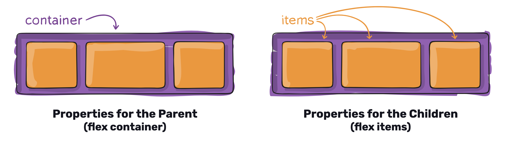
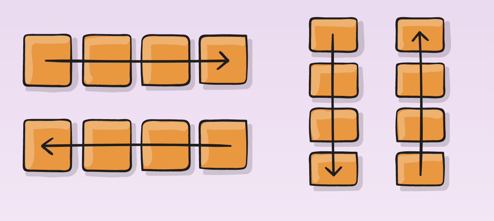
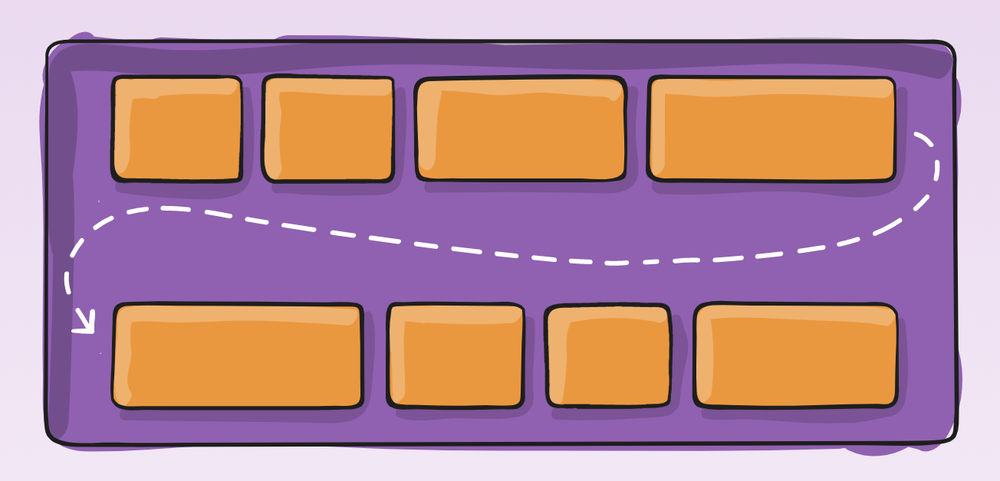
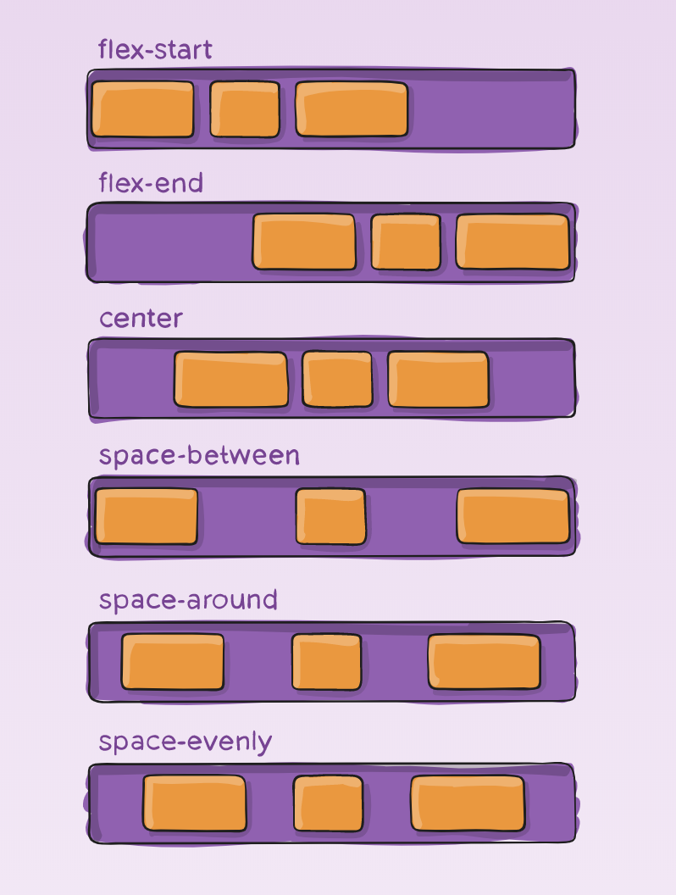
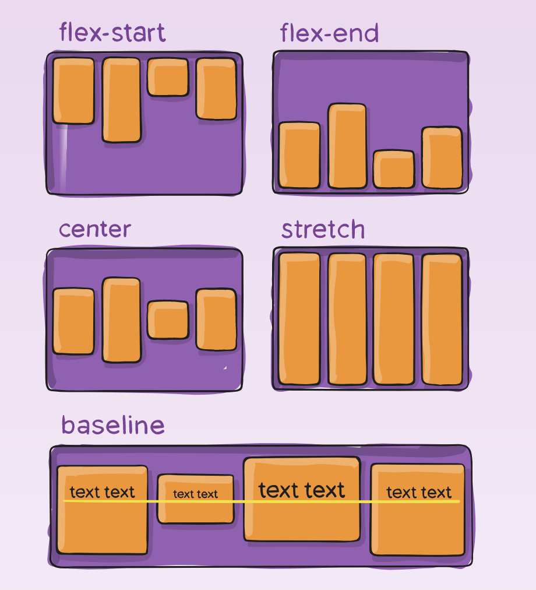
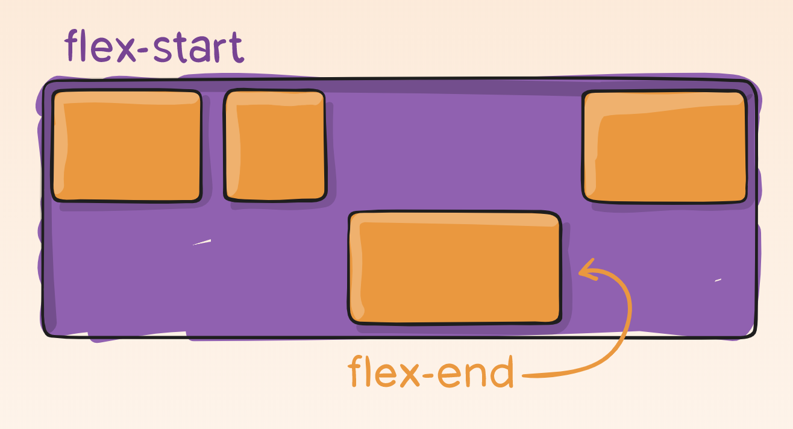
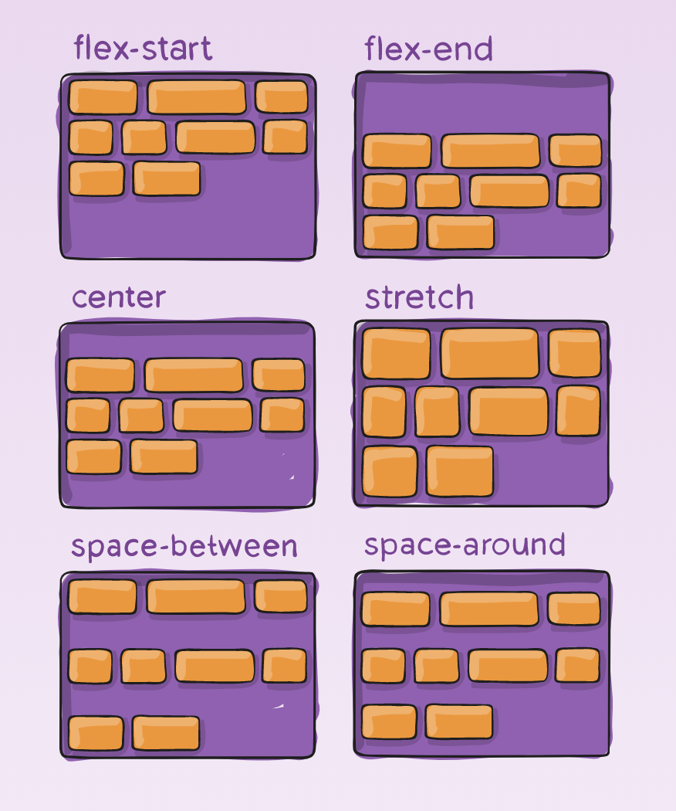

# HTML/CSS 2

1. [HTML/CSS 2 Lecture Notes](#HTMLCSS-2-Lecture-Notes)
1. [Additional Resources](#Additional-Resources)
1. [HTML/CSS 2 Mini Project](#HTMLCSS-2-Mini-Project)
1. [HTML/CSS 2 Afternoon Project](#HTMLCSS-2-Afternoon-Project)

# Lecture Slides

https://slides.com/awestenskow/html-css-2#/

# Student Learning Objectives

- Student understands and can implement the position properties
- Student can implement the display properties (block, inline, inline-block)
- Student can use the inspector to inspect elements
- Student can use the overflow property
- Student can use the box-shadow property
- Students can use flexbox

# HTML/CSS 2 Lecture Notes

## Position

The `position` property is used to specify the position of an element on the screen.

There are five main values we can give this property:

- `static` - this is the default value for an element, and it tells the element to render in order with the document flow.

- `relative` - this will tell the element to render relative to its normal position in the document flow.

- `absolute` - this will position an element relative with the nearest positioned ancestor. If there is not an ancestor, it will use the document body

- `fixed` - this will position the element relative to the view port. This means that the element will always be displayed to our screen.

- `sticky` - this will position an element based on the users scroll position. It toggles between fixed and relative. It will be relative until it hits a scroll position threshold then become fixed.

## Display

The `display` property is what is used to specify the display behavior of the element.

The values we can give the display preoperty are:

- `block` - A block-level element always starts on a new line and takes up the full width available.

- `inline` - An inline element does not start on a new line and only takes up as much width as necessary. This will not allow you to modify the height and width.

- `inline-block` - Works just like inline, but we can modify the height and width.

- `flex` - This will declare the element to be a flex container and use flex box tools for child elements.

- `none` - This is used to hide or show an element without actually deleting them.


## Flex Box

Flex box is a tool in CSS that we can use to create a layout, align items, and distribute white space inside of a container. We will apply the `display: flex` to the parent container, and then use that flex container to manipulate the layout for the children elements inside.



We can use `flex properties` to help create this.

Flex Properties:

`flex-direction` - this will determine the axis of how to align items placed inside of the container (vertical or horizontal)
_ row
_ column



`flex-wrap` - by default, flex items will try to sit on the same line so we can tell the overflowed items to wrap to the next line
_ wrap
_ no-wrap \* wrap-reverse



`justify-content` - this determine how much space to put between each flex item
_ space-around
_ space-between
_ flex-start
_ flex-end
_ center
_ space-evenly



`align-items` - this defines the behaviour for how flex items are laid out along the axis
_ center
_ left
_ right
_ flex-start \* flex-end



`align-self` - this can be used on a flex item to determine it's own alignment to override the one set by align items \* same values as align-items



`align-content` - this can be used to mutate the distribution of space between flex items \* same values as justify-content



## Overflow

`overflow` is the property we can use to determine what happens to elements that flow over the height or width of an element.

Values:

- `visible` - this is the default overflow property and will still display overflowed elements
- `hidden` - this will hide all of the elements that overflow
- `scroll` - this will make the container element scroll to see the overflowed elements

## Z-index

The `z-index` can be used to determine what element to show when they stack on each other. The higher the index value, the stronger the presence meaning it will overlap other elements and be displayed. `1` is the default z-index value.

```css
z-index: 4;
```

## Box Shadow

The `box-shadow` property is what can be used to added shadows to an element. This will help to make a popping effect inside our web page

```css
box-shadow: 1px 1px 1px 1px black;
```

The values go `h-offset`, `v-offset`, `blur`, `spread`, `color`.

# Additional Resources

## Games for Flexbox

- https://flexboxfroggy.com/
- http://www.flexboxdefense.com/

## Lecture Specific

- [W3 Position Property](https://www.w3schools.com/css/css_positioning.asp)
- [CSS Tricks Flex-Box](https://css-tricks.com/snippets/css/a-guide-to-flexbox/)
- [MDN Overflow Property](https://developer.mozilla.org/en-US/docs/Web/CSS/overflow)

## General

- https://www.w3schools.com - a great resource for learning the basics about HTML and CSS.
  > Note: For all things JavaScript, avoid w3, and instead refer to MDN.
- https://developer.mozilla.org/en-US/ - phenomenal resource for all things web dev, and more comprehensive HTML and CSS coverage than w3. Should be utilized as **THE** primary go-to for all things JavaScript.
- https://css-tricks.com/ - another great resource for all things web dev, but is an especially great resource for more advanced CSS applications. Provides comprehensive tutorials on creating more complicated visual effects.
- https://www.figma.com/ - accessible, convenient tool for making wireframes that can be used collaboratively.
- https://dribbble.com - website with free design templates created by top designers. Great source for inspiration on designs.
- https://coolors.co/ - convenient tool for creating color schemes for a site.
- https://cssgradient.io/ - convenient tool for creating custom color gradients.
- https://meyerweb.com/eric/tools/css/reset/ - free CSS Reset sheet that should cover most common issues

## Videos

- https://www.youtube.com/watch?v=UB1O30fR-EE&app=desktop - Traversy Media Introductory video to HTML. Traversy Media is a great resource for all things web dev.
- https://www.youtube.com/watch?v=yfoY53QXEnI&app=desktop - Traversy Media Introductory video to CSS.
  > Note: Students are strongly encouraged to watch both of these videos over the weekend to review and strengthen their foundation in HTML/CSS

## Articles

- https://blog.benmyers.dev/clickable-divs/ - article covering why developers shouldn't create "clickable" divs, and should instead practice using buttons
- https://hacks.mozilla.org/2015/03/understanding-inline-box-model/ - great article covering `inline` elements in depth
- https://www.impressivewebs.com/difference-block-inline-css/ - article covering the differences between `inline` and `block` elements
- https://www.impressivewebs.com/inline-block/ - follow up article that covers `inline-block`
- https://www.semrush.com/blog/semantic-html5-guide/ - useful article that visually lays out, reviews, and compares and contrasts appropriate vs inappropriate use of semantic html.
- https://meiert.com/en/blog/dry-css/ - article that covers how to optimize your styling and make your CSS DRY (Don't Repeat Yourself)

## Social Media

- https://twitter.com/i/moments/994601867987619840 - superb developer/designer that provides actionable tips to set your designs apart
- https://visme.co/blog/website-color-schemes/ - Visme is a blog that provides guides to making better visual designs. This specific blog post covers 50 great website color schemes

## Extensions

- https://chrome.google.com/webstore/detail/eye-dropper/hmdcmlfkchdmnmnmheododdhjedfccka?hl=en - Eye Dropper: Useful tool for picking out colors from a web page.

# HTML/CSS 2 - Mini Project

Code along with instructor as they clone sections of websites.

# HTML/CSS 2 - Afternoon Project

Clone the website given to you by your instructor.
