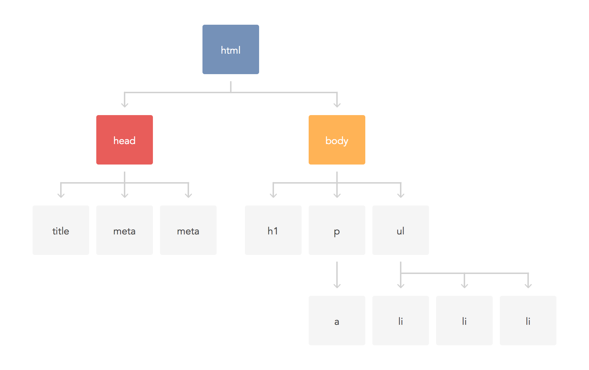

# Javascript 4

Lecture Slides: https://slides.com/dmweb/javascript-4

Mini Project: https://github.com/DevMountain/vanillajs-2-afternoon

Afternoon Project: https://github.com/DevMountain/vanillajs-2-afternoon

# Student Learning Objectives

<details>
 <summary>JavaScript + HTML</summary>
 <ul>
  <li>Students can explain why Javascript is used on the Web</li> 
  <li>Students can add Javascript to an HTML file using inline and external scripts</li> 
  <li>Students can use `alert` and `console.log` to display information</li> 
  <li>Students can describe the `window` object as the global object</li> 
 </ul>
</details>

<details>
 <summary>DOM</summary>
 <ul>
  <li>Students can describe the DOM</li>
  <li>Students can use `getElementById` to access a single element in Javascript</li>
  <li>Students can use `getElementsByTagName` to access multiple elements in Javascript</li>
  <li>Students can use `.style`, `.className`, and `.classList` to change a single element's styling</li>
  <li>Students can use `.innerText` and `.innerHTML` to change a single element's content</li>
  <li>Students can use `.value` on an input element to get the element's value</li>
  <li>Students can add an event handler as an HTML attribute</li>
  <li>Students can use `querySelector` and `querySelectorAll` to select elements in Javascript</li>
  <li>Students can use `createElement`, `append`, `parentNode` and `remove` to dynamically update the DOM</li>
  <li>Students can use `getAttribute` and `setAttribute` to update element properties</li>
 </ul>
</details>

<details>
 <summary>Events</summary>
 <ul>
  <li>Students can handle events using HTML attributes, Javascript properties, and `addEventListener`</li>
  <li>Students can discuess the benefits and drawbacks of each approach</li>
  <li>Students can define event bubbling</li>
  <li>Students can use `stopPropagation` and `preventDefault` in event handlers</li>
  <li>Students can use the `DOMContentLoaded` event</li>
 </ul>
</details>

<details>
 <summary>Compatibility and Security</summary>
 <ul>
  <li>Students can describe `XSS`</li>
  <li>Students can describe polyfills and their importance</li>
 </ul>
</details>

# Lecture Notes

## Adding Javascript To HTML

There are two ways we can go about adding javascript to our HTML file.

### Same File

We can add javascript to our same HTML file by using the `<script>` tag. Anything in between the script tag will be read as javascript. It's best practice to put this script tag at the bottom of our body tag.

```html
<body>
  <header>
    <h1>Header Title</h1>
  </header>

  <!-- Put the script tag at the bottom of the body tag -->
  <script>
    const name = 'Tayte'

    console.log(name) // result: 'Tayte'
  </script>
</body>
```

### External File

We can also create another `.js` file to house all of our javascript. We just need to create another file that ends with the extension `.js` so our editors will know it is a javascript file. We will still be including a `<script>` tag, however we will not be putting our scripts inside of the tag. We will use the `src` attribute to connect the files. For the value of the `src` attribute, we will provide the path to the file.

Html File:

```html
<body>
  <header>
    <h1>Header Title</h1>
  </header>

  <!-- Put the script tag at the bottom of the body tag -->
  <script src="script.js"></script>
</body>
```

Javascript File:

```javascript
const name = 'Tayte'

console.log(name) // result: 'Tayte'
```

## Displaying Information

In javascript there are a couple built in functions that we can use to display information to us while in the development process.

### Console Log

`console.log()` - This is the function we can use to log data to our dev console to help make developing a little easier to see exactly what data we have.

```javascript
const myName = 'Tayte'

console.log(myName) // result: 'Tayte'
```

### Alert

`alert()` - This is the function we can use in web browsers to display a popup message or an alert to the user

```javascript
const myName = 'Tayte'

alert(myName) // result: a popup message in the browser would appear displaying the string of 'Tayte'
```

### Console Dir

`console.dir()` - this will display an interactive list of the properties from the specified object.

```javascript
console.dir(window) // result: a list of window props and values
```

## Window Object

The `window object` is the object that represents an open window in the browser. We can use this object to interact with our browser window and get any data from it that we need or any make any changes that we need. It's import to note the the `window object` is the global object that our code will live in, inside a broswer environment.

We can access the object by referencing `window`.

```javascript
console.log(window) // result: logs the window object
```

## DOM

DOM is the acronym we use for `Document Object Model`. The DOM is an object representation or blueprint for our web pages structure and content. We can interact with the DOM to manipulate our web page to change how our HTML elements are being displayed, how they are interacted with, change content, etc.

It's easy to think of the DOM as a tree. Each element that exists on the DOM is known as a `node`. We can target these nodes with Javascript to create functionality within our page.



## Interacting With The DOM

We can interact with the DOM by accessing the `document` object. The document object represents the DOM tree and it is used as an entry point to interacting the the DOM. The DOM tree includes elements such as `<body>`, `<input>`, `button`, and many others. Using the `document` object, we can add event listeners and capture node values.

### Accessing Elements

There are many built in methods from the `document` object that we can use to access specific elements from the DOM.

`.getElementById` - This method will return an element that has the a matching id to the one we pass in as an argument.

```html
<button id="myBtn">My Button</button>
```

```javascript
const myBtn = document.getElementById(`btn`)
```

`.getElementByTagNames` - This method will return a collection of the element's child elements with a specifide tagname as a NodeList object. The NodeList object is a collection of nodes. These nodes can be accessed by index numbers starting at 0. Just like an array.

> tip: you can use the `.length` property to determine how many child nodes there are

> tip: the '\*' parameter value will return all child nodes

```html
<ul id="myList">
  <li>One</li>
  <li>Two</li>
  <li>Three</li>
</ul>
```

```javascript
const list = document.getElementById('myList')

const numberOfLiTags = list.getElementsByTagName('li')

console.log(numberOfLiTags) //result: an HTMLcollection containing the `li` tags
```

`.querySelector` - this returns the first element in our document that matches the specified selector. Here we can use selecters to find an element just like CSS.

```html
<ul id="myList" class="list">
  <li>One</li>
  <li>Two</li>
  <li>Three</li>
</ul>
```

```javascript
// element
const myList = document.querySelector('ul')

// id
const myList = document.querySelector('#myList')

// class
const myList = document.querySelector('.myList')
```

`.querySelectorAll` - this works just like querySelector, however this will return a NodeList with all of the matching elements with the specified selector.

```html
<ul id="myList" class="list">
  <li>One</li>
  <li>Two</li>
  <li>Three</li>
</ul>
```

```javascript
const listItems = document.querySelector('li')
```

### Node Properties

Each node has a set of properties that we can interact with to perform certain actions.

`innerText` - This will return all of the text content inside of an element and avoid returning any html elements.

```html
<ul id="myList">
  <li>One</li>
  <li>Two</li>
  <li>Three</li>
</ul>
```

```javascript
const myList = document.getElementById('myList')

console.log(myList.innerText)
```

`innerHTML` - The innerHTML property sets or returns the HTML content (inner HTML) of an element.

```html
<ul id="myList">
  <li>One</li>
  <li>Two</li>
  <li>Three</li>
</ul>
```

```javascript
const myList = document.getElementById('myList')

console.log(myList.innerHTML)
```

`className` - this will get or set the value for the elements class

```html
<div class="divOne" id="divOne"></div>
```

```javascript
const divOne = document.getElementById('divOne')

console.log(divOne.className)
```

`classList` - this is the object that we can use to remove or add classes to an element

```html
<ul class="list" id="myList">
  <li>One</li>
  <li>Two</li>
  <li>Three</li>
</ul>
```

```javascript
const myList = document.getElementById('myList')

// Add A Class
myList.classList.add('show')

// Remove A Class
myList.classList.remove('show')

// Toggle A Class
myList.classList.toggle('show')
```

We can also use `.toggle()` and this will determine if the class already exists, if it does remove it, if not then add it

`style` - this is the object we can use to adjust a style property on an element

```html
<ul class="list" id="myList">
  <li>One</li>
  <li>Two</li>
  <li>Three</li>
</ul>
```

```javascript
const myList = document.getElementById('myList')

myList.style.background = 'red'
```

`value` - on input elements we can use the value property to access what has been typed into the input box

```html
<input type="text" id="myInput" />
```

```javascript
const myInput = document.getElementById('myInput')
console.log(myInput.value)
```

### Events and Event Handlers

Events are 'things' that happen in our html file. We can add event handlers to our html elements to start some logic when a specific event happens.

Syntax:

```html
<tagname event="js to happen">content</tagname>
```

We first have the event attribute, this could such events as `onclick`, `onmouseover`, `onmouseleave`, etc. After we will put our javascript logic inside of quotes.

Better Example:

```html
<button onclick="submit()">Submit</button>
```

```javascript
function submit() {
  alert('Post has been submitted!')
}
```

### Add Event Listener

We can use `.addEventListener()` to add a specific event to an element and a provide it an event handler function to fire when the event occurs for the element.

```html
<button id="myButton">Submit</button>
```

```javascript
const myButton = document.getElementById('myButton')

myButton.addEventListener('click', function() {
  console.log('button was clicked')
})
```

Notice how we first capture the element then add the event listener. The first argument to the event listener function is the event, this will always be a string. Then we have the event handler function that will execute when the event happens.

# Vanilla Javascript Two

This lecture is an extention of a the vanilla javascript one lecture. We will cover more topics when working with the DOM.

## Events

An Event in Javascript and HTML is anytime the user interacts with our document.

### Handling Events

We can add and handle events by using the built in `document` method `.addEventListener()`. This built in document method will add an `event type` to an element and also define an `event handler` callback function.

#### Event Type

There are many different events that we can add to an element.

##### Mouse Events

`click` - the element will listen for a click action

`dblclick` - the element will listen for a double click

`mouseover` - the element will listen for a cursor to move over the element

`mouseenter` - the element will listen for the cursor to enter the element area

`mouseout` - the element will listen for the cursor to leave the element area

##### Keyboard Events

`keydown` - the element listens for any key to be pressed

`keyup` - the element listens for a key to lift

##### Form Events

`reset` - this will listen for a reset action

`submit` - this will listen for a submit event

##### Focus Events

`focus` - listens for the element to receive focus

`blur` - listens for an element to lose focus

##### Input Events

`change` - listens for a change in a controlled input

> Note: input fields of `type="text" do not fire a change event until the focus is changed`

#### Event Handler

The `event handler` is the callback function that we will provide to the `.addEventListener` method. This will be executed when the passed in event occurs.

> Note: We can only have one event handler per event

```javascript
function eventHandler(event) {
  // logic that happens when the event happens
}
```

The `event` parameter will be an object that we can use to access additional properties about the event that occurs. This is a great way to capture the value from an input field.

Example:

```html
<input type="email" id="myInput" />
```

```javascript
// Create variable to store the input value
let inputValue = ''
// Add the event and function to handle the event
document.getElementById('myInput').addEventListener('change', function(event) {
  inputValue = event.target.value
  console.log(inputValue)
})
```

## Event Bubbling

Event bubbling is when events bubble up through the DOM tree. Any time an event happens, it will bubble up and being activated for every parent element going until the `window` object. This means that if any parent elements have the same event, the callback function associated with that event will fire.

```html
<!-- HTML ELEMENTS -->
<div class="parent">
  <button class="child">Click Me</button>
</div>
<!-- Javascript -->
<script>
  // Capture the elements
  const parent = document.querySelector('.parent')
  const child = document.querySelector('.child')

  // Add Events
  parent.addEventListener('click', function() {
    console.log('parent was clicked')
  })

  child.addEventListener('click', function() {
    console.log('child was clicked')
  })
</script>
```

Try running the code from above, you'll notice how when we click the button with the class of child, it will console log 'child was clicked'. The event then bubbles up and sees that the parent element has a 'click' event as well so it will fire it's callback. This can cause some weird behaviour that we don't want.


### Stopping Event Bubbling

We can stop event bubbling by using `.stopPropagation()`. This is a built in method that comes from the `event` object that the event handler callback receives.

```html
<!-- HTML ELEMENTS -->
<div class="parent">
  <button class="child">Click Me</button>
</div>
<!-- Javascript -->
<script>
  // Capture the elements
  const parent = document.querySelector('.parent')
  const child = document.querySelector('.child')

  // Add Events
  parent.addEventListener('click', function() {
    console.log('parent was clicked')
  })

  child.addEventListener('click', function(event) {
    // we receive the event obj as a param in the callback and then can use it to call stopPropagation
    event.stopPropagation()
    console.log('child was clicked')
  })
</script>
```

## Forms

Forms can be used to capture a specific set of user data. We can create a form using the `<form>` html tag. An html form contains `form elements`, form elements are different types of input elements like text fields, check boxes, and submit buttons inside of `<form>` tags.

### Form Input Element

The `<input>` form element is the most essential form element. The `<input>` element can be displayed in different ways depending on the `type` attribute it recieves.

`<input type="text">` - Defines a one line input field
`<input type="radio">` - Defines a radio button
`<input type="submit">` - Defines a button to submit the form data

### Form Lable Element

The `<label>` element defines a label for an input element and will tell the user what the input should be used for; username, password, email, etc.

```html
<label>Username</label> <input type="text" />
```

### Form Example

```html
<form>
  <label>Email</label>
  <input type="email" />
  <label>Password</label>
  <input type="password" />
  <!-- Submit Button -->
  <input type="submit" id="form-btn" />
</form>
```

When a button inside of a form is clicked, a `submit` event fires. The submit event will try to make a request to some server and cause the page to refresh. We do not want this to happen because it will make us lose whatever has happened in the web page.

### Canceling Default Events

We can prevent the form from causing a page refresh by canceling the `submit` event. We can cancel a default event by using the built in event method `.preventDefault()`.

`.preventDefault()` - this method cancels the event if it is cancelable, meaning that the default action that belongs to the event will not occur.

```html
<!-- form -->
<form>
  <label>Email</label>
  <input type="email" />
  <label>Password</label>
  <input type="password" />
  <!-- Submit Button -->
  <input type="submit" id="form-btn" />
</form>

<!-- javascript -->
<script>
  const formBtn = document.getElementById('form-btn')

  formBtn.addEventListener('click', function(event) {
    // prevent default event
    event.preventDefault()
    // stop event bubbling
    event.stopPropagation()

    console.log('stopped form submission')
  })
</script>
```

Notice how the page no longer refreshes when we hit that submission button. The `.preventDefault()` method can be used for any default event and is not limited to forms, it's just most commonly used with forms.

## DOM Selectors

We can use some built `document` methods to grab specific elements from the DOM.

`.querySelector` - this returns the first element in our document that matches the specified selector. Here we can use selecters to find an element just like CSS.

```html
<ul id="myList" class="list">
  <li>One</li>
  <li>Two</li>
  <li>Three</li>
</ul>
```

```javascript
// element
const myList = document.querySelector('ul')

// id
const myList = document.querySelector('#myList')

// class
const myList = document.querySelector('.myList')
```

`.querySelectorAll` - this works just like querySelector, however this will return a NodeList with all of the matching elements with the specified selector.

```html
<ul id="myList" class="list">
  <li>One</li>
  <li>Two</li>
  <li>Three</li>
</ul>
```

```javascript
const listItems = document.querySelectorAll('li')
```

## Node Methods

`.createElement('element name')` - this method creates an element with the name that is passed in as an argument

`.appendChild('element to append')` - this method appends a node as the last child of a node list

Creating a button with text example:

```javascript
// create the button element
const btn = document.createElement('BUTTON')
// add inner text
btn.innerText = 'Click me'
// Add the new button into the body element
document.body.appendChild(btn)
```

`.remove()` - this method removes the element from where it belongs

```html
<div id="divOne">Here is divOne</div>
<div id="divTwo">Here is divTwo</div>
<div id="divThree">Here is divThree</div>

<script>
const elementToRemove = document.getElementById('divTwo');
elementToRemove.remove(); // Removes the div with the 'divTwo' id
</script
```

`.getAttribute()` - this method returns the value of an attribute using a specified name

```html
<button class="btn">Click Me!</button>

<script>
  const btnClass = document.querySelector('btn').getAttribute('class')
  console.log(btnClass) // result: 'btn'
</script>
```

`.setAttribute()` - this method takes in two arguments, the attribute name and the attribute value, then will add the attribute to an element

```html
<button class="btn">Click Me!</button>

<script>
  const btn = document.querySelector('btn')
  btn.setAttribute('id', 'myBtn')
</script>
```

## Node Property

`.parentNode` - The parentNode property returns the parent node of the specified node, as a Node object

```html
<div class="parent">
  <button class="child">Click Me</button>
</div>

<script>
  const btn = document.querySelector('.child')
  const btnParent = btn.parentNode
</script>
```

# Additional Resources

- [FreeCodeCamp - JS DOM Manipulation](https://www.freecodecamp.org/news/dom-manipulation-in-vanilla-js-2036a568dcd9/)
  A basic review/walk-through of simple DOM manipulation with Vanilla JS
- [JavaScript 30](https://javascript30.com/)
  It’s free to sign up and gain access to these 30 Vanilla JS challenges. Each project is accompanied with a walk-through video. Good for students who want more repetition.
- [Dev.to - JS DOM Manipulation](https://dev.to/bouhm/a-vanilla-js-guide-on-mastering-the-dom-3l9b)
  Very thorough guide to interacting with the DOM using Vanilla JS, with references to MDN docs.
- [Gist - JS in the DOM Cheatsheet](https://gist.github.com/thegitfather/9c9f1a927cd57df14a59c268f118ce86)
  Great reference or ‘cheat sheet’ for basic Vanilla JS and interacting with the DOM.
- [Medium - Event Bubbling](https://medium.com/better-programming/understanding-preventdefault-stoppropagation-and-stopimmediatepropagation-when-working-with-61842c37e012)
  Event bubbling, preventDefault, and stopPropagation.

## Videos

- [Dev-Ed - JS in the DOM](https://www.youtube.com/watch?v=wiozYyXQEVk)
  Basics of event listeners. Uses for...of loop which will be a new for loop for most students.
