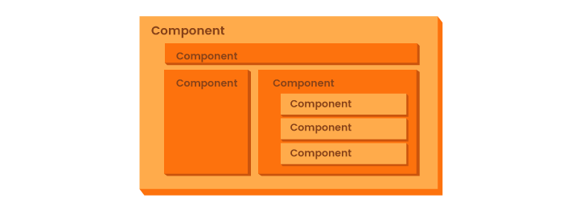
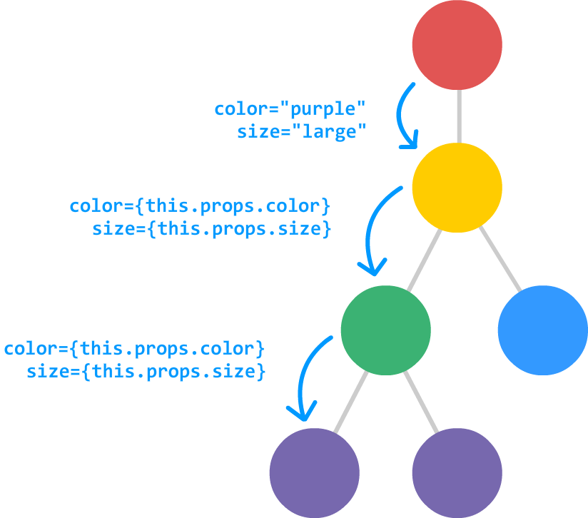

# React One

This is the lecture repo used for React One. In this we will go over what React is, what it is used for, and how to get started.

Lecture Slides: https://slides.com/dmweb/react-1

Afternoon Project: https://github.com/DevMountain/react-1-afternoon

# Student Learning Objectives

<details>
  <summary>React</summary>
  <ul>
    <li>Student can create an app with create react app</li>
    <li>Student can render JSX on the screen</li>
    <li>Student understands JSX (escaping JSX, className vs class)</li>
    <li>Student can initialize state in a constructor function</li>
    <li>Student can render state on the screen</li>
    <li>Student can use event handlers and e.target.value</li>
  </ul>
</details>

## What Is React?

React is a Javascript library that was created and is maintained by Facebook. React is used to manage the DOM and create highly performant user interfaces and front end applications.

Some popular websites that use React are:

- Instagram

- Netflix

- Imgur

- Tesla

- Venmo

## Why Use React?

React makes front end Javascript development much easier.

Uses JSX.

Virtual DOM.

Utilizes something called `components` that are self contained pieces of the application.

These components make up the `component based architecture` for our application

## Component Based Architecture

Component based architecture is where an application uses components to make up each part of our application. This creates organization in our code and an understanding on how to layout our components in our application.



## Virtual DOM

The `Virtual DOM` is a light-weight copy of the actual DOM. The Virtual DOM is the representation we will be using to update our user interface in React. Anytime there is a change to the Virtual DOM, it will go through a process called `reconciliation`. This is where it compares itself to the actual DOM to see if there has been any changes, and if there has been then it will update the actual DOM only at the part that needs to be updated.


## Get Started

We will get started by using the command line application `create-react-app` to quickly make a React application. Create react app is a bootstrapping tool that helps developers easily get off the ground and started with a React project.

We first need to globally install `create-react-app` onto our machines.

In the terminal run:

```bash
$ npm install -g create-react-app
```

The `-g` is what is known as a flag, it pretty much just says to install this globally to our machine so we can use it anywhere.

After installing create react app, go ahead and create a new react project by running:

```bash
$ create-react-app name-of-app
```

Once your react app has been made, `cd` into it and run:

```bash
$ npm start
```

This command will start our react server and will be available to us on `http://localhost:3000`

## Components

Components are the building blocks of a React application.

A component is either a class or a function that will return a React element that will describe how a section of the user interface will be displayed and interacted with.

> Note: it's important to keep in mind that components need to start with an uppercase letter

### Functional Component

A functional component is a simple component or sometimes referred to as a `dumb component`. That is because a functional component cannot hold any local state values to it, it's meant to just receive data and return a React element.

```javascript
import React from 'react'

const DumbComponent = () => <h1>Hello, I'm a functional component</h1>

export default DumbComponent
```

### Class Component

A class component is a complex component or sometimes referred to as a `smart component`. That is because a class component can hold local state values and we can also write logic to manipulate those state values. A class component will still return a React element.

```javascript
import React from 'react'

class SmartComponent extends React.Component {
  // render method
  render() {
    return <h1>Hello, I'm a class component</h1>
  }
}

export default SmartComponent
```

Above, notice that we have a method called `render`. This method is where we will choose what elements to return to make up the React element. This is the part of the component that is known as `JSX`.

### JSX

The tag syntax inside of a component is not a string or HTML. It's called `JSX`, which is a syntax extension to Javascript. JSX produces React "elements" that describe how the user interface should appear for that React element. This looks very familiar to HTML, so if you are comfortable with that, then it should be easy to get the hang of.

```jsx
<div>
  <h1>This is JSX</h1>
  <p>
    It looks very similar to HTML, but it is not HTML. It is an extension of
    Javascript that helps us create the UI of a component
  </p>
</div>
```

### State

Class components can hold what is called `state`. State is what is used to keep track of data that is specific to a component. State is simply just an object that uses key / value pairs.

We will add a `constructor` function to our class component to hold our `state` object. Inside of our constructor we need to invoke `super`, this will allow us to set state.

```javascript
import React from 'react'

class MyComponent extends React.Component {
  // constructor will go to the top of the component
  constructor() {
    // super function to allow us to set data
    super()
    // state object
    this.state = {
      // key / value pairs here
      name: 'Tayte',
    }
  }
  render() {
    return <h1>This is a class component that is holding state</h1>
  }
}

export default MyComponent
```

We can display our state values inside of our JSX by wrapping them inside of `{}`.

```javascript
import React from 'react'

class MyComponent extends React.Component {
  constructor() {
    super()

    this.state = {
      name: 'Tayte',
    }
  }
  render() {
    return <h1>My Name is: {this.state.name}</h1>
  }
}

export default MyComponent
```

Notice how we are saying `this.state.name`. We use `this` to refer to the component that we are currently in, which is the class `MyComponent`. Inside of our component we have a `state` object that has a `name` property on it.

Now our component should be displaying `Tayte` inside of the `<h1>` tag.

#### Updating State

We can update the values on our state the `.setState()` method that is built into the component.

This method will allow us to pass a new value to our state and cause or component to `re-render` to now show the changes in our state.

How to use it:

1. We first want to target our component using the `this` keyword.

2. Then we call `.setState()`

3. setState will receive an object as an argument.

4. We will then choose the property(s) to update and what their new value will be using key / value pairs.

```javascript
this.setState({
  propertyToUpdate: newValue,
})
```

We will usually have `this.setState()` be executed inside of the callback function that is passed to the event handler.

#### Event Handler

We can use event handlers inside of our JSX to have specific logic be executed when a specific event occurs on the element that has the event handler set.

This is very similar to vanilla javascript an we will place it as an attribute on an element.

```jsx
<h1 onClick={console.log('I have been clicked!')}>
  This is a JSX element that has an event handler
</h1>
```

The big difference is that we prefix most events with `on` and the value will be wrapped in `{}` instead of `""`.

#### Updating State In Action

Let's take a look at what it's like to update our name on state to whatever the value of an input box is.

```javascript
import React from 'react';

class MyComponent extends React.Component {
    constructor(){
        super();

        this.state = {
            name: 'Tayte'
        }
    }

    // we can write methods for our class here just like a normal class
    handleChange(event){
        // use this.setState to update state
        this.setState({
            // we first choose what property on state to update
            // then decided its new value
            // here we are assigning the value of whatever is typed into the input box
            name: event.target.value
        })
    }


    render(){
        return (
            <h1>My name is: {this.state.name}</h1>
            <input type="text" onChange={this.handleChange}/>
        )
    }
};

export default MyComponent;
```

### Data In React

React will handle its data using a `unidirectional data flow`. This means that data is passed down from the top of the application to the bottom. We can determine what top and bottom are using our `component architecture design`.

We can use events to send data back up the `component tree`.


Data can be passed as `props` from a parent component to a child component

### Props

Using `props` allow us to pass data from a parent component to a child component. We do this rendering a child component inside of our `JSX` then setting an attribute on the rendered component with the data that we want to pass as a value for the attribute.



PLEASE REFER TO `src/app.js` FOR AN EXAMPLE AND MORE INFORMATION ON PROPS.

# Additional Resources

## General

The React documentation from reactjs.org is a great resource for understanding the React topics introduced as part of today's lecture:

- [React Docs - JSX](https://reactjs.org/docs/introducing-jsx.html) - A brief explanation of JavaScript Syntax Extension (JSX) in React, including its importance and use in React
- [React Docs - Rendering Elements](https://reactjs.org/docs/rendering-elements.html) - An overview of element rendering in the React DOM node and an introduction into React DOM updating
- [React Docs - Components](https://reactjs.org/docs/components-and-props.html) - An introduction to composing, rendering and extracting components in React - both functional and class components. This resource also introduces the props object and how it is used to pass information into components.
- [React Docs - State and Lifecycle](https://reactjs.org/docs/state-and-lifecycle.html) - A brief overview of state implementation, updating and application in React class components including an explanation for the setState method and the asynchronous nature of the method. This resource also introduces component lifecycle methods that can be used in class components.
- [React Docs - Events](https://reactjs.org/docs/handling-events.html) - Includes an introduction to event handling in React components including a comparison of event handling using JavaScript vs. React

## Videos

- [Traversy Media - React Crash Course](https://www.youtube.com/watch?v=sBws8MSXN7A) - This is a great resource from Traversy Media about React and getting started building applications using React
- [Mosh - React Tutorial](https://www.youtube.com/watch?v=Ke90Tje7VS0) - This is another good resource for getting started developing in React
  from Programming with Mosh

## Articles

- [Tania Rascia - Getting Started with React](https://www.taniarascia.com/getting-started-with-react/) - Overview and walkthrough tutorial for starting out in React (this link is suggested in the React docs)
- [Medium - Advantages of React](https://medium.com/@hamzamahmood/advantages-of-developing-modern-web-apps-with-react-js-8504c571db71) - A great Medium article detailing React some of the advantages associated with developing web applications using React
- [Medium - Component Based Architecture](https://medium.com/@dan.shapiro1210/understanding-component-based-architecture-3ff48ec0c238) - Another great Medium article that takes a deeper dive into explaining React's component-based architecture, what it is, how it differs to other application structures, and finally some of the benefits and/or drawbacks of using a component-based architecture
- [Exclamation Labs - Unidirectional Data Flow](https://www.exclamationlabs.com/blog/the-case-for-unidirectional-data-flow/) - This is an interesting opinion article about data flow constructs and benefits associated with unidirectional data flow
