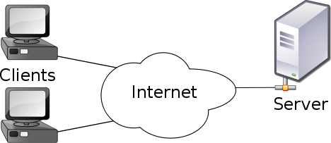
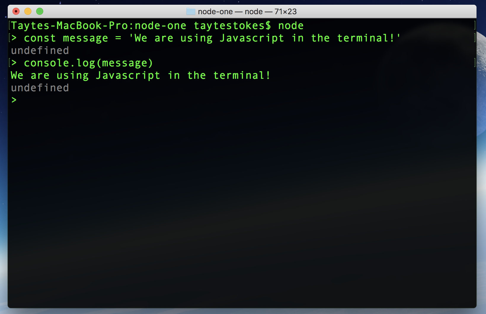

# Node One

In this lecture we talk about Node, Express, and NPM.

Lecture Slides: https://slides.com/dmweb/node-one

Afternoon Project: https://github.com/DevMountain/node-1-afternoon

## Student Learning Objectives

### Node

- Student can create an index.js file
- Student can run a javascript file using node
- Student can run a javascript file using nodemon
- Student can describe that node is the V8 javascript engine
- Student can require and use other files in node

### Servers

- Student can describe the role of servers in a client-server model
- Student can identify the parts of code that listen to external requests

### NPM

- Student can npm init
- Student can npm install
- Student can npm install --save
- Student can describe the role of a package.json file
- Student can describe the purpose of the node_modules folder
- Student can .gitignore node_modules

### Express

- Student can install and require express
- Student can start a basic express server by creating an app and listening on a port
- Student can write the handler function with the correct parameters `req`, `res` and `next`
- Student can access url parameters on req.params
- Student can set up an endpoint path to expect multiple `params`
- Student can use req.query
- Student can send data back with res.send and res.json
- Student can set a status code with res.status

# Lecture Notes

## HTTP Review

HTTP stands for Hyper Text Transfer Protocol and it is the protocol we follow when making requests and receiving responses from a client to a server.

### Client

This is usually a personal computer that talks to a server through the internet.

The client is also known as the `front-end` part of our application.

We will be using `React` for our front-end.

### Server

This is usually a computer that has clients that will talk to to request information from.

The server is also known as the `back-end` of the application.

We will be building our servers with `Node`.



## Node

Node is a `javascript runtime environment`.

Javascript has been around since 1995 and for a while it was only used inside of a browser environment, meaning that was the only place we could use it.

This meant that developers were having to code in multiple languages to create a front-end and back-end to their applications.

When Node came out, it allowed developers to write Javascript code that runs directly on the computer process itself, rather than being confined to a browser environment. This means that Node can be used to write server-side applications that have full access to the operating system, file system, etc.

Node was written in `C`, `C++`, and `Javascript`. It was built on top of the `V8 Javascript` engine. This is the same engine that browsers like `Google Chrome` use.

### Node In The Terminal

We can run node in the Terminal by typing the command:

```bash
$ node
```

This will turn the terminal into an interactive javascript environment.



### Running A Javascript File

We can also execute a JS file by running the terminal command

```bash
$ node "name of file to execute"
```

It's important to keep note that this works similar to `REPL` where only the last item will be returned, unless we are to console.log values.

### Nodemon

We can use `nodemon` to constantly watch our file to execute it when theres a resfresh.

Install nodemon globally:

```bash
$ npm install -g nodemon
```

Run `nodemon` on a file instead of `node`.

## NPM

NPM stands for `Node Package Manager`.

This is where we can get access to a bunch of great libraries to use inside of our code.

To use it we just need to have `node` installed onto our machine and then we need to initialize our applicaiton to use it.

When in the project directory, run the terminal command:

```bash
$ npm init -y
```

This command will initialize a `package.json` file for us so we can install packages from `npm` into our project.

This file will look something like this:

```json
{
  "name": "node-one",
  "version": "1.0.0",
  "description": "In this lecture we talk about Node.",
  "main": "index.js",
  "dependencies": {},
  "devDependencies": {},
  "scripts": {
    "test": "echo \"Error: no test specified\" && exit 1"
  },
  "keywords": [],
  "author": "",
  "license": "ISC"
}
```

## Express

One of the primary uses of Node is to act as a `server`.

A server will receive a request then perform some logic and return a response.

`Express` is the most popular framework we can use to build a server with node.

It will make it easier to matchup HTTP methods to by using `endpoints` to control what data a front end application can send and ask for.

### Getting Started

First we need to install express into our project to use it.

```bash
$ npm install express
```

REFER TO THE `serverSetup.js` FILE FOR MORE INFORMATION ABOUT SETTING UP EXPRESS

### Endpoints

Endpoints are what we use to create a way for a front end application to make requests to our server.

To create an endpoint, we will use the object returned from `express()`. This object will have the methods we can use to receieve specific `RESTful Requests`.

Let's look at the syntax for one:

```javascript
app.get('/api/users', handlerFunc)
```

The endpoint is comprised of three parts:

The Method: - this is where we declare what type of request we are expecting. For example: `get`, `post`, `put`, `delete`.

The Path - this is easy to think about as an entrance to our server or a "gate".

The Handler Function - the handler function is the function that will be executed when a request hits this end point.

## Handler Functions

`Handler Functions` are the functions that we use to handle a request that is made to our server.

This function receives two objects as default arguments. These objects are the `request` and `response` object.

```javascript
app.get('/api/users', (req, res) => {
  // logic here to handle the req
})
```

> Note: req will always be before res

### Request Object

The `req` object is an object that will contain information about the incoming request. This where we can access information from the `query`, and the `params` of the request.

`req.params` This is the object that we can use to get the data from the params of a request.

We declare the param variable to use in the `path` of our endpoint. We will prefix the param with a colon.

```javascript
// front end request w/ parameter
axios.get('/api/users/1')

app.get('/api/users/:id', (req, res) => {
  // we can access what ever info is sent through the id param
  console.log(req.params.id)
})
```

Using the colon is like telling javascript to treat it as a placeholder, and whatever is sent through we can access it on the `req.params` object.

`req.query` This is the object that we can use to get data from the queries of a request.

We will not add any extra information to our `path` when using a query, unlike params.

```javascript
// front end request w/ query
axios.get('/api/users?name=tayte')
// front end request w/ multiple queries
axios.get('/api/users?name=tayte&age=27')

// back end endpoint
app.get('/api/users', (req, res) => {
  // notice how we dont set anything special in our path

  // we can access the name tayte from the query using the query obj
  console.log(req.query.name) // this will log tayte
  console.log(req.query.age) // this will log 27
})
```

### Response Object

The `res` object is an object that we will use to set information about the response and send it back.

This object will have built in methods that we can use to add information to the response that we will send back.

#### Sending A Response

`res.send()` is a function that we can use so whatever is passed in as an argument to the function will be sent back as the `response`.

```javascript
res.send('Hello')
```

Above, we are sending a string of hello back. This is what will fill the `response.data` object on the front end.

#### Setting A Status Code For The Response

We can set custom status codes for the response by using the `.status()` method before we send back a response. We will pass in the status code that we want this end point to respond with.

```javascript
res.status(200).send(users)
```

# Node One Mini-Project

None

# Node One Afternoon-Project

https://github.com/DevMountain/node-1-afternoon

---

# Additional Resources

_Because some of these topics are more conceptual than others, they might not have as many direct resources - like tutorials - but will still have articles or videos explaining them on a basic level_

## Node

### Video Resource

https://www.youtube.com/watch?v=pU9Q6oiQNd0 - explanation of what Nodejs is and what it's used for

### Other Resources

https://nodejs.org/en/docs/guides/ - guides section on nodejs.org, great for reference if you're doing anything you haven't done before in node

https://en.wikipedia.org/wiki/Node.js - great definition of what Node is and why it was built/what it is used for

https://www.tutorialsteacher.com/nodejs/nodejs-tutorials - more tutorials on basic node functionality

## Servers

### Video Resource

https://www.youtube.com/watch?v=CDxaRfwzFrs - what is a server and how do they work?

## NPM

### Video Resource

https://www.youtube.com/watch?v=ZNbFagCBlwo - very short video on npm

### Other Resources

https://docs.npmjs.com/ - docs

https://www.tutorialspoint.com/nodejs/nodejs_npm.htm - good reference for npm syntax and terminal commands

https://nodesource.com/blog/an-absolute-beginners-guide-to-using-npm/ - "An Absolute Beginner's Guide to Using npm"

## Express

### Video Resource

https://www.youtube.com/watch?v=45dAt9Gz8rE - good entry level express video

### Other Resources

https://developer.mozilla.org/en-US/docs/Learn/Server-side/Express_Nodejs - multiple resources including step-by-step tutorials

https://expressjs.com/ - docs on expressjs that might go a bit more in-depth than you want but really goes into what you can do with express
