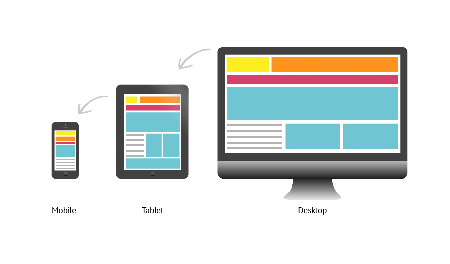
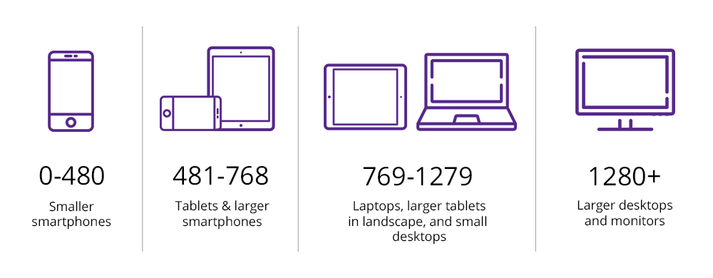

# HTML CSS 3

In this lecture we discuss media queries and animations.

Lecture Slides: https://slides.com/dmweb/html-css-3

Afternoon Project: https://github.com/DevMountain/media-queries-afternoon

## Student Learning Objectives

### Media Queries

- Student can describe why media queries are used
- Student can use media queries to build a responsive app
- Student can create a breakpoint with `@media` tags
- Student can use `min-width` when creating a breakpoint
- Student can use `max-width` when creating a breakpoint
- Student can specify multiple parameters for breakpoint using `and` with min-width and max-width

### Animations

- Student can specify the rules of an animation using `@keyframes`
- Student can use `from` and `to` to specify specific styles to change with `@keyframes`
- Student can use percentages to specify specific styles to change with `@keyframes`
- Student can use `animation-name` on class to specify animation to be used
- Student can use `animation-duration` on class to specify animation's duration
- Student can use `animation-iteration-count` on class to specify how many times animation will run
- Student can use `transition` shorthand property to smoothly transition style changes
- Student can specify which css class properties `transition` will be applied to.
- Student can use `refs` to trigger animations in react

## Responsive Design

Responsive design is the process of building an application's user interface (UI) to dynamically adjust based on the size of the device being used to access it.

Older websites were not designed with responsive design principles in mind, and this has lead to undesirable user experiences. Take a look at https://www.spacejam.com/archive/spacejam/movie/jam.htm for an example of an unresponsive website.

Nowadays, it is standard practice to ensure that websites are responsive. Some examples of responsive designs can be found here: https://www.awwwards.com/50-examples-of-responsive-web-design.html.

The reason responsive design is important is because increasing numbers of users are consuming the internet via mobile devices or tablets. In 2017, there were an estimated 3.5 billion web users world wide, and around 2 billion of them exclusively use the internet on mobile devices. Nowadays, it is a requirement in any front-end developer position to be capable of designing responsive websites.

When building your application, there are three main devices to develop for: **Mobile**, **tablet**, and **desktop**.



### Extraction

The **extraction** design process of building an application is when developers start from desktop design, and then "extract" features until the design fits smaller devices.

The extraction design process often results in a desktop application that is rich with features, and a mobile application that feels like an ineffective afterthought. This is because it can be difficult to include all of the features from the desktop view when working with a mobile sized viewport. With extraction design, mobile views can be left feeling either cluttered and clunky, or less usable and effective than the desktop design.

### Enhancement

The **enhancement** design process is when developers begin by deciding the core features and layout for the mobile view, and then "enhance" the application in order to fill out the desktop design.

This will allow you to add features into your app as you scale up with the view port size. This is also known as "mobile first" development. This process more reliably results in a robust mobile view and an equally effective desktop design.

In short, it's easier to scale up than it is to scale down.

## Media Queries

In CSS, we can use **media queries** to help create a "responsive design".

A media query is a set of CSS rules that will apply to devices based on the viewport size of the device being used to access the page.

The syntax for writing a media query looks like the following:

```css
@media (max-width: 500px) {
  /* New Styles To Apply Based On Width */
  body {
    background: tomato;
  }
}
```

Media queries are defined in CSS by using the `@media` statement. In the parentheses, we can specify the dimensions of the view port that our styles will apply to. The value passed into the parentheses can be referred to as a **break point**. Typically, break points are set with a `min-width` or `max-width` value. Inside the curly braces, we style normally.

### Other Uses

Media queries can be implemented in CSS sheets themselves as seen above, as well as in the link to a specific stylesheet as seen below

```HTML
<link rel='stylesheet' media='all' href='normal.css' />
<link rel='stylesheet' media='print' href='print.css' />
<link rel='stylesheet' media='screen and (min-width: 701px)' href='medium.css' />
```



### Min-Width

Min-width is the value used to declare the minimum width of screen size that the styling block will be applied to. This means that the styles will be applied when the view port width is higher than the `min-width` value.

```css
@media (min-width: 500px) {
  /* Styles will only be applied when view port width is 500px and above */
  body {
    background: orange;
  }
}
```

### Max-Width

Max-width is the value used to declare the maximum point of screen width that the styling block would apply to. This means that the styles will be applied if the view port width is smaller than the `max-width` value.

```css
@media (max-width: 500px) {
  /* Styles will only be applied when view port width is 500px and lower */
  body {
    background: orange;
  }
}
```

You can use `max-width` or `min-width` interchangeably, but it's best to stick with one or the other to make your code more clear.

## Animations

Animations are used to dynamically animate elements on our web page. When utilized well, animations enrich the user experience and keep users on a site. Check out https://www.theglyph.studio/#home for an example of a site that utilizes animations well. When utilized poorly, animations can be distracting and unpleasant, and can push users away. Take a look at https://www.lingscars.com/ for an example of what poorly utilized animations can look like.

There are a multitude of ways to achieve an animation effect on a webpage, including scripting through javascript or even other languages. For this guide, we'll focus on two CSS techniques for creating animations. For a more comprehensive overview of CSS animations, check out MDN's Documentation here: https://developer.mozilla.org/en-US/docs/Web/CSS/CSS_Animations/Using_CSS_animations

### Keyframes

To reiterate, keyframes are one method that can be used to create an animation via CSS. Keyframes are declared with `@keyframes`, followed by a name that can be used to reference the keyframe. The @keyframes CSS "at-rule" controls the intermediate steps in a CSS animation sequence by defining styles for keyframes (or waypoints) along the animation sequence.

```css
@keyframes spin {
}
```

There are a couple ways that we can apply style waypoints using a keyframe. One way is by using `from` and `to`. `from` and `to` can be used to define a set of style rules that specify the start and end state of an element in CSS.

```css
@keyframes spin {
  from {
    transform: rotate(0deg);
  }
  to {
    transform: rotate(180deg);
  }
}
```

Another way to specify waypoints is by using percentages inside of the animation, which enables greater specificity and control over how the animation will act.

```css
@keyframes spin {
  0% {
    transform: rotate(0deg);
  }
  50% {
    transform: rotate(180deg);
  }
  100% {
    transform: rotate(90deg);
  }
}
```

After creating a keyframe animation, the keyframe needs to be applied to the desired selector.

```css
.square {
  height: 75px;
  width: 75px;
  background: peachpuff;
  /* tells what animation to use */
  animation-name: spin;
  /* tell how long to run animation */
  animation-duration: 2s;
  /* specify how many times the animation should run */
  animation-iteration-count: infinite;
  /* we can change the animations direction */
  animation-direction: alternate-reverse;
  /* we can smooth our animations */
  animation-timing-function: linear;
}
```

One thing to note is that animation begins automatically when elements are loaded once the animation has been applied via CSS. Would you always want your animations to auto-fire? Fortunately, it is possible to write code so that animations only occur when specific events occur, like an onClick.

To accomplish this, we can create a CSS class, like the one pictured below, that is designed to apply the desired animation properties to an element, but hasn't yet been appied to any specific element.

```css
.square-spin {
  animation-name: spin;
  animation-duration: 2s;
  animation-iteration-count: infinite;
  animation-direction: alternate-reverse;
  animation-timing-function: linear;
}
```

Next, we can create state on our component and create a method that will toggle the value on state from true to false. Then we can conditionally add the class to the element depending on what our state is.

```js
export default class App extends Component {
  constructor() {
    super()

    this.state = {
      spinning: false,
    }
  }

  animate = () => {
    this.setState({
      spinning: !this.state.spinning,
    })
  }

  render() {
    return (
      <div>
        <div
          className={this.state.spinning ? 'square square-spin' : 'square'}
          onClick={this.animate}
        ></div>
      </div>
    )
  }
}
```

Keep in mind that this is just one way of controlling an animation for an element in React.

For more information on using Keyframes and controlling animations with the animation property, look here: https://developer.mozilla.org/en-US/docs/Web/CSS/animation.

### Transitions

Transitions are another way to animate elements. To use transitions, all we need to do is use the `transition` property in our CSS styling blocks. CSS Transitions are a module of CSS that lets developers create gradual transitions between the values of specific CSS properties. The behavior of these transitions can be controlled by specifying their timing function, duration, and other attributes.

In the following example, we apply a transition property to create a simple hover effect, and specify a duration for the animation cycle.

```css
#transition-element {
  height: 50px;
  width: 50px;
  margin: 25px auto;
  background: salmon;
  /* transition property to change values */
  transition: 0.2s;
}

#transition-element:hover {
  transform: scale(1.1);
  border-radius: 50%;
}
```

For more information on CSS Transitions, check out MDN's Guide: https://developer.mozilla.org/en-US/docs/Web/CSS/CSS_Transitions/Using_CSS_transitions

Additionally, if you're ever struggling with creating a desired effect via CSS, try searching for results from https://css-tricks.com/. It's a fantastic resource for not only CSS, but also HTML, JS, JQuery, and many other front-end technologies.

Finally, remember that there are a multitude of means of achieving animation effects on a webpage, including scripting with javascript, or relying on libraries and frameworks like React-Spring, React-Motion, or GreenSock. In this guide, we simply focused on using transitions and keyframes within CSS to achieve animation effects.

# Additional Resources

Most of these will be just MDN or css-tricks because the content isn't inherently complicated, it's just a collection of new syntax and properties students haven't seen yet

### Media Queries

- [CSS tricks is a very good stop for media query overviews](https://css-tricks.com/css-media-queries/)
- [How to designate specific stylesheets for specific screen resolutions](https://css-tricks.com/resolution-specific-stylesheets/)
- [Obligatory MDN article (MDN is just that good)](https://developer.mozilla.org/en-US/docs/Web/CSS/Media_Queries/Using_media_queries)
- [Good one-page 'cheat sheet' style of media query syntax](https://www.tutorialrepublic.com/css-tutorial/css3-media-queries.php)

### Animations

- [ CSS tricks back at it again](https://css-tricks.com/almanac/properties/a/animation/)
- [ List of CSS properties that can be animated](https://developer.mozilla.org/en-US/docs/Web/CSS/CSS_animated_properties)
- [MDN Animations page](https://developer.mozilla.org/en-US/docs/Web/CSS/CSS_Animations) and [MDN Transitions page](https://developer.mozilla.org/en-US/docs/Web/CSS/CSS_Transitions) - good for learning the difference between the two and when to use one or the other

### Pseudo Class Selectors

- [CSS Tricks 3 for 3!](https://css-tricks.com/pseudo-class-selectors/)
- [MDN Pseudo Classes](https://developer.mozilla.org/en-US/docs/Web/CSS/Pseudo-classes)

### Articles

- [Mobile First Design](https://mayvendev.com/blog/mobilefirst) An article on why you should use mobile-first design.
- [Refs and the DOM](https://reactjs.org/docs/refs-and-the-dom.html) Docs on creating react refs. Refs can be used to more conveniently access elements and apply animations/transitions directly.
- [Article that goes over some interesting animations/transitions applied with CSS.](https://webdesign.tutsplus.com/articles/15-inspiring-examples-of-css-animation-on-codepen--cms-23937) Raw code is accessible.

### Video Resources

- [Media Queries](https://www.youtube.com/watch?v=5xzaGSYd7jM) - pretty good for just media queries but the whole playlist below is recommended for both this and animations
- [CSS Animation Playlist](https://www.youtube.com/watch?v=jgw82b5Y2MU&list=PL4cUxeGkcC9iGYgmEd2dm3zAKzyCGDtM5) This is a youtube playlist of 13 videos that go in depth on youtube media queries and animations. It's very good but might be pretty basic or too slow for some
- [Pseudo Class Selectors](https://www.youtube.com/watch?v=0VDx1570X3U) - pseudo class video that goes much more in depth than is really necessary

### React-Motion

This is a react-specific animation library.

- Repo/docs: https://github.com/chenglou/react-motion
- Paul Sherman tutorial: https://www.pshrmn.com/tutorials/react/animation/react-motion/
- \<Motion\> component tutorial (scrimba cast): https://scrimba.com/casts/c67ygAr
- \<TransitionMotion\> component tutorial (scrimba cast): https://scrimba.com/casts/cdNzpuk
