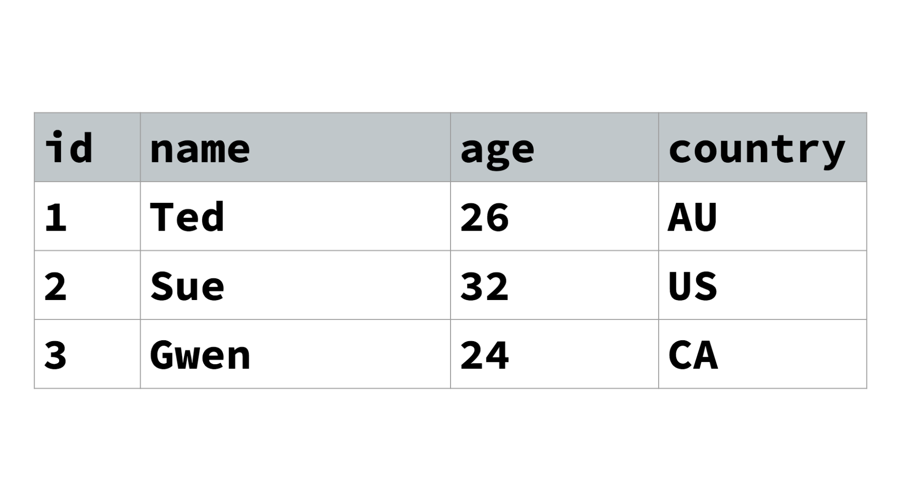

# SQL 1

Lecture Slides: https://slides.com/dmweb/scott-s-sql-one

Mini Project: https://github.com/DevMountain/sql-1-mini

https://github.com/DevMountain/sql-1-afternoon

> NOTE: Both the mini and afternoon projects will be completed on https://postgres.devmountain.com
>
> Students should comment their queries as they go and then send them to their mentor over slack upon completion.

## Student Learning Objectives

<details>
 <summary>Objectives Information</summary>

### Databases

- Student understands the purpose of databases
- Student understands relational databases and tables
- Student understands value types
- Student understands SQL vs PostgreSQL (?)

### SQL

- Student can create a table
- Student can utilize constraints (?)
- Student can insert a row
- Student can delete a row (?)
- Student can query with \* or specific columns
- Student can query results with a where clause
- Student can use comparison operators (Greater, less than, equals, not equals)
- Student can use IN/Not/And/OR/Like operators
- Student can order by
- Student can use max, min, avg, sum
- Student can use count(\*)
- Student can use limit
- Student can drop a table (?)

</details>

# SQL 1 Lecture Slides

https://slides.com/matias_perez/scott-s-sql-one/

# SQL 1 Lecture Notes

<details open>
 <summary>Lecture Introduction</summary>
In this lecture we introduce databases, SQL (Structured Query Language), and PostgreSQL. Database computers and database softwares are used because they are incredibly efficient at storing, processing, and managing enormous amounts of information. 
 <br />
 <br />
Some developers love dealing with databases and database languages, as they can offer a relief from the feelings of frustration and confusion that can occur when doing the flexible and somewhat arbitrary work involved in the frontend when using HTML, CSS, and JavaScript.  Databases, including PostgreSQL databases, are often very strongly typed, and are consequently much more rules-based and rigid. Databases are more conducive to a binary, "it's either right, or it's wrong" approach to programming.
 <br />
 <br />
 
>Note: The corollary to databases being generally so strongly typed is that they can be unforgiving. For example, missing semi-colons or the use of double quotes in place of single quotes can break code.  
 
 </details>

## SQL VS PostgreSQL

<details open> 
 <summary>SQL Information</summary>
SQL (Structured Query Language) is a domain-specific language used in programming, and it is designed for managing data held in a relational database management system. 
 <br/>
 <br/>

PostgreSQL, also known as Postgres, is a free and open-source relational database management system emphasizing extensibility and technical standards compliance. PostgreSQL is the language that we will be using to interact with our database to store, retrieve, delete, and update data. Although it shares much in common with SQL, be aware that there are significant differences, particularly when it comes to syntax.

An SQL server is a database management system which is mainly used for e-commerce and providing different data warehousing solutions. PostgreSQL is an advanced version of SQL which provides support to different functions of SQL like foreign keys, subqueries, triggers, and different user-defined types and functions.

> Note: Although there are differences between PostgreSQL and SQL, know that once you know one version of SQL, you can quickly learn them all. Differences are generally minor when it comes to common usage.

For more information on the differences between SQL and PostgreSQL, check out this article: https://www.educba.com/sql-server-vs-postgresql/.

For a fantastic resource for learning more about PostgreSQL, checkout their official docs at https://www.postgresql.org/docs/.

</details>

## Databases

<details open>
 <summary>Databases Summary</summary>
A database is an organized collection of data, generally stored and accessed electronically from a computer system. Where databases are more complex, they are often developed using formal design and modeling techniques.

The database management system (DBMS) is the software that interacts with end users, applications, and the database itself to capture and analyze the data. The DBMS software additionally encompasses the core facilities provided to administer the database. The sum total of the database, the DBMS and the associated applications can be referred to as a "database system". Often the term "database" is also used to loosely refer to any of the DBMS, the database system or an application associated with the database.

PostgreSQL is a **relational database**. A relational database is organized based on the "relational model of data." This model organizes data into one or more tables (or “relations”) of rows and columns, with a unique key for each row. Usually, each entity type--or resource--that is described in a relational database has its own table with the rows representing instances of that type of entity, and the columns representing values attributed to that instance. Since each row in a table has its own unique key, rows in a table can be linked to rows in other tables by storing the unique key of the row to which it should be linked (where such unique key is known as a “foreign key”). Data relationships of arbitrary complexity can be represented using the simple set of concepts present in relational databases.

To put it simply, relational databases look like Excel spreadsheets, and they work by relating and referencing rows and columns from one table to another.

Virtually all relational database systems use SQL as the basic language for querying and maintaining the database, and relational databases are extremely popular. The reasons for the dominance of relational databases are: simplicity, robustness, flexibility, performance, scalability and compatibility in managing generic data.

A NoSQL database, or **non-relational database**, provides a mechanism for storage and retrieval of data that is modeled in means other than the tabular relations used in relational databases.

</details>

Here's an example of what a table in a relational database might look like:



> Note: Tables in a relational database are built based on a "relation schema", or a blueprint.

### Schema

<details>
 <summary>Schema Summary</summary>
 
A **database schema** is a blueprint for how a database is structured. Put another way, a database schema is the skeleton structure that represents the logical view of the entire database. It defines how the data is organized and how the relations among them are associated. A database schema contains a collection of relation schemas for a whole database.

A **relation schema** is the logical definition of a table--it defines what the name of a table is, and what the name and datatype of each column is.

For a useful tool for creating database schemas, check out https://dbdiagram.io/home.

A relation schema for the table above might look similar to this:

```sql
CREATE TABLE instructors (
    id INTEGER PRIMARY KEY,
    name TEXT,
    age INTEGER,
    country TEXT
);
```

In the code above, we are creating an instructors table, and specifying which datatypes are allowed to be inserted into specified columns of the table.

</details>

#### Schema - Datatypes

When setting up our schema we will determine what **datatype** is allowed in our columns. There are a multitude of datatypes possible within PostgreSQL, so we will only cover a few here. For additional information on datatypes, refer to the official postgres docs, or check out this link here: http://www.postgresqltutorial.com/postgresql-data-types/.

<details>
 <summary>Empty Values</summary>

`Null` - This data type means an empty value.

</details>

<details>
 <summary>Numeric Values</summary>

`Integer` - This data type will define a round number.

`Decimal` - This data type can have unlimited decimal values.

`Float` - This data type can have values up to 15 decimal places.

`Serial` - This data type is an incrementing integer, usally used along with the `Primary Key` constraint in order to establish a unique identifier for a row in a table.

</details>

<details>
 <summary>Character Values</summary>

`Text` - This data type allows you to enter unlimited characters as a string.

`Varchar(n)` - This data type and its corresponding parameter enable you to limit the number of characters inserted as a string.

</details>

<details>
 <summary>Boolean Values</summary>

`Boolean` - This data type is either true or false.

</details>

#### Schema - Constraints

<details>
 <summary>Constraints Information</summary>
 
Constraints are the rules enforced on data columns on table. These are used to prevent invalid data from being entered into the database. This ensures the accuracy and reliability of the data in the database.

Constraints could be column level or table level. Column level constraints are applied only to one column whereas table level constraints are applied to the whole table. Defining a data type for a column is a constraint in itself. For example, a column of type DATE constrains the column to valid dates.

The following are commonly used constraints available in PostgreSQL.

- NOT NULL Constraint − Ensures that a column cannot have NULL value.

- UNIQUE Constraint − Ensures that all values in a column are different.

- PRIMARY Key − Uniquely identifies each row/record in a database table.

- FOREIGN Key − Constrains data based on columns in other tables.

- CHECK Constraint − The CHECK constraint ensures that all values in a column satisfy certain conditions.

- EXCLUSION Constraint − The EXCLUDE constraint ensures that if any two rows are compared on the specified column(s) or expression(s) using the specified operator(s), not all of these comparisons will return TRUE.

Example of NOT NULL Constraint:

```sql
CREATE TABLE COMPANY4(
   ID INT PRIMARY KEY     NOT NULL,
   NAME           TEXT    NOT NULL,
   AGE            INT     NOT NULL,
   ADDRESS        CHAR(50),
   SALARY         REAL
);
```

</details>

### SQL Statements

SQL statements are queries that we make to our database.

A few things to note about SQL Statements:

1. We use a semicolon to declare the end of a statement.

2. We cannot have a trailing comma on our scripts.

3. We need to use single quotes, not double.

4. It's common practice to write queries using all capital letters, but this is not necessary. Choose either uppercase or lowercase, but remain consistent.

#### Common Statements

<details>
 <summary>Insert Statement</summary>

We can use `insert statements` to add data into our tables. The syntax for an insert statement looks like the following:

```sql
INSERT INTO instructors
(name, age, country)
VALUES
('Zach', 26, 'USA');
```

Above, we are adding a person into the database table instructors. Insert statements begin with the `INSERT INTO` keyword followed by the name of the table we are inserting data into. Then, in parentheses, we select the column names we would like to add to. We then use the `VALUES` keyword, followed by another pair of parentheses to include the specific data we would like to insert into the corresponding columns.

> Note: It's import that the data in the VALUES parentheses line up with the column order specified.

</details>

<details>
 <summary>Select Statement</summary>

`Select` statements are used to query our database for information. The structure for a `select` statement looks like the following.

```sql
SELECT name
FROM instructors;
```

```sql
SELECT *
FROM instructors;
```

Above, we declare two select statements using the `SELECT` keyword. Both are followed by the column name that we want to select data from, and then by the `FROM` keyword and the table we would like to select from . In the second select, we use an asterisk as a means of selecting all the data from every column of the instructors table. This is known as the universal, asterisk, or splat selector.

##### WHERE CLAUSE

We can use a `where clause` to add a filter to our select statements.

```sql
SELECT *
FROM instructors
WHERE name = 'Zach';
```

###### Comparison Operators

Operators can be combined with the `WHERE` clause for greater specificity.

`>` - Greater than.

```sql
SELECT *
FROM instructors
WHERE id > 2;
```

`<` - Less than.

```sql
SELECT *
FROM instructors
WHERE id < 2;
```

`>=` - Greater than or equal to.

```sql
SELECT *
FROM instructors
WHERE id >= 2;
```

`<=` - Less than or equal to.

```sql
SELECT *
FROM instructors
WHERE id <= 2;
```

`!=` - Does not equal.

```sql
SELECT *
FROM instructors
WHERE id != 2;
```

###### Logical Operators

`AND` - Check for multiple conditions to be true.

```sql
SELECT *
FROM instructors
WHERE id != 2
AND id < 3;
```

`OR` - Check for only one of multiple conditions to be true.

```sql
SELECT *
FROM instructors
WHERE name = 'Zach'
OR id = 2;
```

###### Null and Not Null

`IS NULL` - Checks for a value to be null.

```sql
SELECT *
FROM instructors
WHERE name IS NULL;
```

`IS NOT NULL` - Checks for a value NOT to be null.

```sql
SELECT *
FROM instructors
WHERE name IS NOT NULL;
```

###### IN Condition

`IN` - This is used as shorthand syntax to act as multiple `OR` conditions.

```sql
SELECT *
FROM instructors
WHERE name IN ('Zach', 'Matt', 'Josh');
```

If we didn't use the `IN` key word, our statement would look like this

```sql
SELECT *
FROM instructors
WHERE name = 'Zach'
OR name = 'Matt'
OR name = 'Josh';
```

###### BETWEEN Condition

`BETWEEN` - This is used to retrieve values in between a range.

```sql
SELECT *
FROM instructors
WHERE id BETWEEN 1 AND 3;
```

##### LIMIT

The `LIMIT` clause restricts the number of rows returned by a select statement.

```sql
SELECT *
FROM instructors
LIMIT 2;
```

This would return the first two rows of data from the instructors table.

##### ORDER BY

`ORDER BY` - This clause will sort the records in our result. This clause can only be used in select statements.

```sql
SELECT *
FROM instructors
ORDER BY id;
```

They `ORDER BY` clause will organize results in ascending order by default.

###### ASC

`ASC` is the keyword we can use with `ORDER BY` to organize by ascending order by the column type specified.

```sql
SELECT *
FROM instructors
ORDER BY id ASC;
```

###### DESC

`DESC` is the keyword we can use with order by to sort our records in the result in descending order.

```sql
SELECT *
FROM instructors
ORDER BY id DESC;
```

</details>

<details>
 <summary>Update Statements</summary>

We can update our data inside of a database by using an `update statement`.

```sql
UPDATE instructors
SET name = 'Joseph'
WHERE id = 2;
```

Above, we have just updated the name for the user with the id of 2. We first use the `UPDATE` keyword followed by the name of the table we are updating. Then we `SET` the name to "Chris" where the user id equals 2.

</details>

<details>
 <summary>Delete Statements</summary>

We can remove or destroy data from our databased by using a `delete statement`.

```sql
DELETE FROM instructors
WHERE id = 2;
```

We first declare the `DELETE FROM` clause, and then declare the table we want to remove data from. We then choose the id of the instructor we want to remove.

> Make sure to add the where clause or the statement will remove everything in the table! SQL is unforgiving. That's why it's common practice to make sure you have an init.sql, and a seeds.sql file that is regularly updated.

</details>

<details>
 <summary>SQL Functions</summary>

There are "functions" that we can use with PostgreSQL. This will usually handle some sort of mathematical logic for us.

`count()` - This returns the count of an expression.

```sql
SELECT count(id)
FROM instructors;
```

> It's important to note that `count` does not count null values. Pass in the `*` to account for all rows.

`min()` - This returns the minimum value of an expression.

```sql
SELECT min(age)
FROM instructors;
```

Above, we are finding the youngest instructor.

`max()` - This returns the maximum value of an expression.

```sql
SELECT max(age)
FROM instructors;
```

Above, we are returning the oldest instructor.

`sum()` - This returns the summed value of an expression.

```sql
SELECT sum(age)
FROM instructors;
```

Above, we now have the sum of the ages for all the instructors.

`avg()` - This function returns the average value of an expression.

```sql
SELECT avg(age)
FROM instructors;
```

Above, we have found the average age of the instructors.

</details>

<details>
 <summary>Dropping A Table</summary>

We can also drop our tables when we need to remove them. Be careful doing this, because we can not restore tables that have been dropped. Once again, SQL is unforgiving.

```sql
DROP TABLE instructors;
```

</details>

# Additional Resources

- https://www.postgresql.org/docs/ - The official docs of PostgreSQL. These are a comprehensive resource on everything PostgreSQL
- http://www.postgresqltutorial.com/ - These are more user-friendly and accesible guides on using PostgreSQL. Highly encourage beginners to look here.
- https://www.educba.com/sql-server-vs-postgresql/ - A brief article on the differences between plain SQL and PostgreSQL.
- Database Diagram Design Tools
  1. https://dbdiagram.io/home - Useful design tool that produces SQL code for you based on the diagrams you create.
     > Note: Even when you specify that the software produced code should be formatted in PostgreSQL, you should **NOT** trust that it is entirely syntactically correct.
  1. https://draw.io - A very basic, but free diagramming tool. Can be used for wireframing or creating charts/diagrams beyond database tables.
  1. https://lucidchart.com - A more elegant and feature-rich collaborative diagramming tool.
     > Note: The free plan is limited to 3 diagrams and 60 objects per diagram.

# SQL 1 Mini Project

https://github.com/DevMountain/sql-1-mini

# SQL 1 Afternoon Project

https://github.com/DevMountain/sql-1-afternoon
