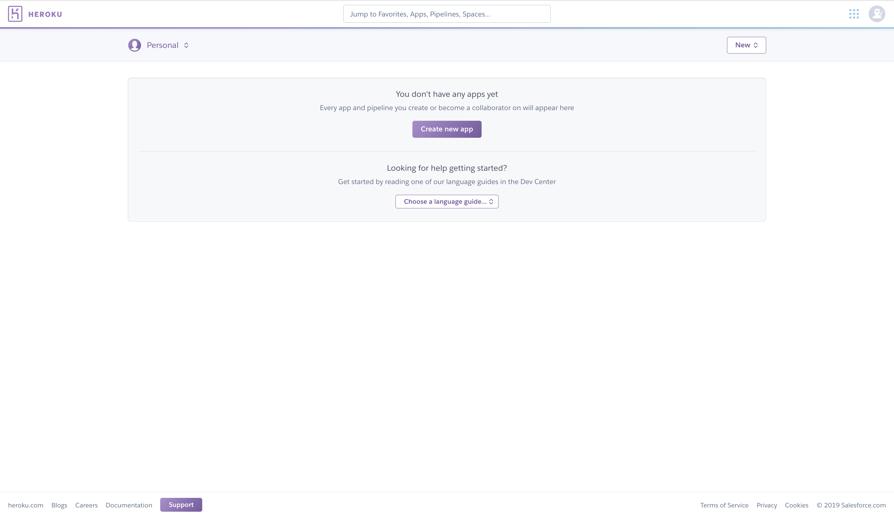
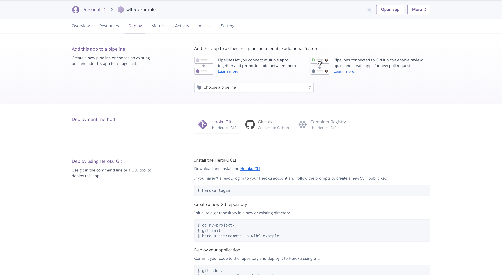
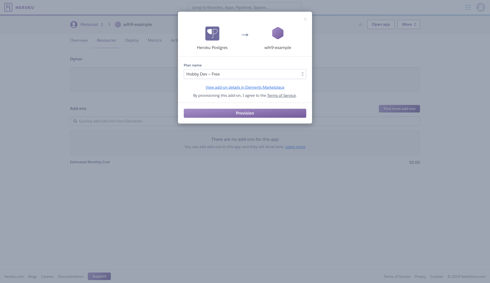
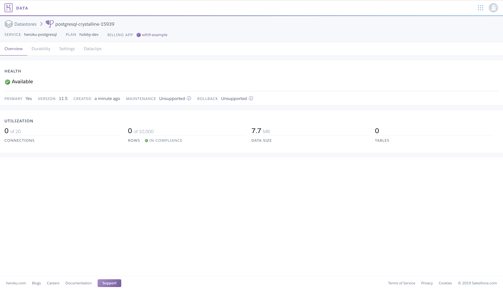
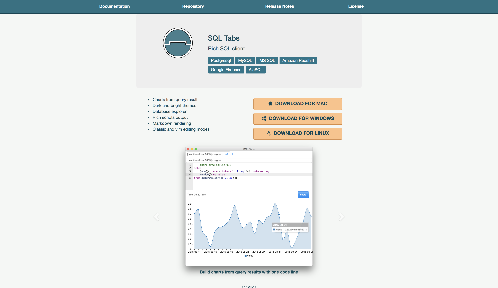
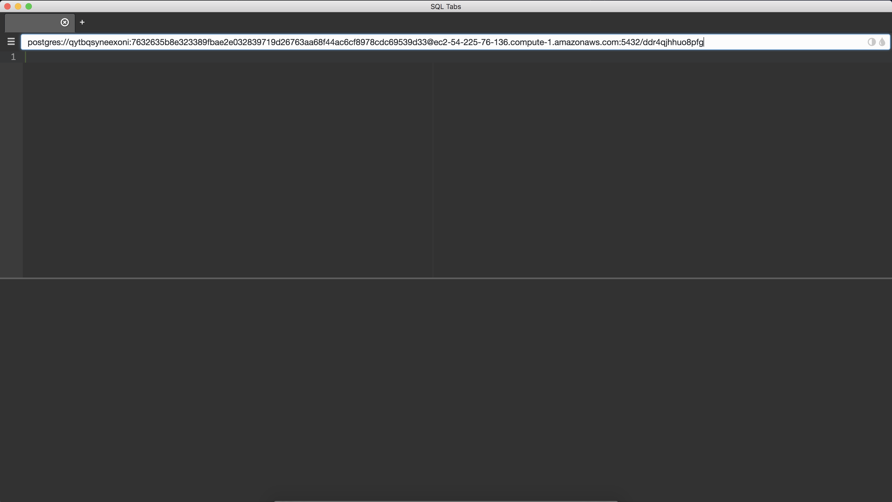

# Node Three

In this lecture, we will talk more about node, setting up our database using Heroku, and how to interact with our databases using SQLtabs.

Lecture Slides: https://slides.com/dmweb/node-three

Mini Project: https://github.com/DevMountain/node-3-mini

Afternoon Project: https://github.com/DevMountain/node-3-afternoon

## Student Learning Objectives

### Database Setup

- Student can/has setup a heroku database (or an equivalent.)
- Student can/has installed SQL Tabs (or an equivalent.)
- Student can make queries to their database using SQL Tabs (or an equivalent.)

### Massive

- Student can install and setup massiveJS to connect their server to their database.
- Student can implement dotenv and store their connection string in a dotenv file.
- Student can use a seed file to set up their database.
- Student can create a db folder with SQL files.
- Student can execute SQL queries with massiveJS.
- Student can use references to arguments in SQL statements (\$n, ...).

### Patterns

- Student understands good organization for their node code dealing with queries

## Heroku Database

We used to install PostgreSQL locally and create databases on our local machine, but it would start to take up a ton of memory and really slow down some students computers. We now will create our database on Heroku's cloud platform.

Visit https://www.heroku.com/ and create your heroku account. After creating your account and verifying it through your email, you should now be able to login and you will see a dashboard like this.



Click on the purple `Create new app` button to start creating your first app. Give your app a name and select the region that it will be hosted in. Just keep it to the US.

After creating a new app, your dashboard should look like this.



Now, click on the `Resources` tab in the top left. We will be adding on a PostgreSQL database to our app.

Now in the `Resources` page, click on the `add-ons` search field and look for `Heroku Postgres` and provision it as `Hobby Dev - Free`.



Now you will see that Postgres has been provisioned to our app so we can click on it to access our database. When you access the database, it will open in a new window for you and you will be looking at the dashboard interface for information about our postgres database.



Now click on the `Settings` tab in the top left, then click on the purple button on the right of the screen that says `View Credentials...`.

You should now see information about our databse regarding the `host`, `database`, `user`, `port`, `password`, `uri`, and `heroku cli`. This is sensitive information that we do not want anyone getting a hold of. We need to make sure that we keep this secure.

The `URI` is what will really matter to us, so keep this page open so we can reference it later.

## SQL Tabs

SQL tabs is the cross-platform interface that we will use to interact with our database directly.

Download your OS version at this link: http://www.sqltabs.com.



After installing the correct files, you will need to configure it.

### Mac

Unzip the download and put it into your applications. You may get a security warning, so you will need to hop into `system preferences` and it will you ask you if trust the third party publisher, then select `Open Anyways`.

### Windows

Unzip the folder then place the application somewhere easy to access like your desktop or a folder that's easy to get to (I recommend desktop).

### Linux

Gunzip the tarbell files then execute then execute `./sqltabs`.

## Connecting SQL Tabs to Heroku Postgres

After installing SQL Tabs, go ahead an open it up. We will need to connect our interface with our database that's hosted on Heroku.

Now head back to your settings for your heroku database and copy the `URI` string. Then go ahead and paste that string in the search bar at the top os SQL Tabs.



Now once the URI has been pasted, we need to append a query onto it. At the end, add `?ssl=true`.

### SSL

SSL stands for `Secure Sockets Layer`. It is the standard security technology for establishing an encrypted link between a web server and a browser. This will allow our SQL Tabs to securely interact with our Heroku Database.

Viola! You now have established a connection. Test it out by creating some tables.

## .ENV

We want make sure that we are trying to stay secure with our sensitive information that we will be using within our code. We can create a `.ENV` file to house environment variables. The variables that are created in this file will be stored on the Node servers `process`.

We can then store the variables that we want to keep private inside of this file. These variables will be things such as `API Keys`, `Database Connections`, `etc`. We DO NOT want to push this information to Github to be stolen.

We need to make sure that we include the `.ENV` file in the `.gitignore` file so that that the file will not be pushed up to Github.

> Note: I have not ignored my .ENV file just so you can refer to it. I deleted the db that the connection string uses, so it will not be harmful for me.

## DOTENV

`dotenv` is the module of code we can use to bring our variables declared in the `.ENV` into our Node server.

We first need to install this module from NPM, in your terminal run:

```bash
$ npm install dotenv
```

Now at the top of our server file, typically called `index.js` we will require this module and invoke the `config` method from it.

```js
require('dotenv').config()
```

We now have access to our environment variables.

## Massive JS

`massive` is a data mapper that we will use to have our server interact with our database.

We first need to install it to our application from NPM, in your terminal run:

```bash
$ npm install massive
```

Once it's installed, require it in to the file that we will use it (index.js).

```js
const massive = require('massive')
```

Now we can invoke the `massive` function passing in our connection string to get connected to our db and return an instance of it.

```js
massive({
    connectionString: CONNECTION_STRING,
    ssl: {rejectUnauthorized: false})
.then((dbInstance) => {
    app.set('db', dbInstance);
});
```

Massive has now set an instance of the heroku postgres database as an object in our application. We can use this object to use the custom SQL statements that we write or the built in methods that come from Massive to interact with our database to create, read, update, and delete the data stored there.

## DB Folder

We will create a folder called `db` at the root of our project. Massive will be able to pick up on this and put our custom SQL statements on the db instance that it returns.

This folder is where we will write our own SQL commands.

### Seed Folder

When ever I create a table, I like to make a copy of the schema and save it as it's own file inside of the `seed folder` that will be nested inside the `db` folder. This way, if I ever have to drop a table I can use the seed file to reference how the `schema` was setup for that table.

## Interacting With The Database In The Controller Functions

We can interact with our database inside of our controller functions that handle the request that is made to our API. We first just need to get the instance of the database that lives on the request object. Since we used a `setter` method to add the database to our `app` object, we need to use a `getter` method to get that object.

An example of the controller function would look like the following

```js
const getRacers = (req, res) => {
  // Get the db instance
  const db = req.app.get('db')
  // use the getRacers sql statement
  db.get_racers().then(racers => {
    // racers will be an array with our racers from the db
    // send the racers back
    res.status(200).send(racers)
  })
}
```

We first get the instance of the database using a `getter` method. Then we use our custom sql statement `get_racers` to interact with our database. Since it returns a promise, we use a `.then()` to handle the response (which will always be an array), then we send a response back to the client from the server.

## Follow The Code

Take a look at the code examples inside this repo to understand the syntax and structure for creating a full CRUD API that interacts with a database.

# Additional Resoures

### General

- [MassiveJS documentation](https://massive-js.readthedocs.io/en/v2/) - There are a lot of neat tips and tricks here that can really level up your usage of massive.
- [Heroku](https://heroku.com) - A hosting service that will allow you to create and host a new database.
- [SQL Tabs](https://www.sqltabs.com/) - A program for interacting with SQL databases. You should download this and use it for testing queries in your own db.
- [Postico - MAC ONLY](https://eggerapps.at/postico/) - A popular client available only for mac, accomplishes the same things as SQLTabs but has a friendlier interface.

### Articles

- [Writing a RESTful API with Express & MassiveJS - Medium](https://medium.com/@alexishevia/writing-a-restful-api-with-express-massivejs-465218800c08) - An article walking through creating a RESTful API from start to finish. A good resorce to read and code along with.
- [Designing a RESTful API with Node and Postgres](https://mherman.org/blog/designing-a-restful-api-with-node-and-postgres/) - An article walking through the thought process of designing a RESTful API using Node and PostgresSQL. It would be worth your time to brush up on RESTful principles as they will become more important as our apps become more complex.

### Videos

- [Database as API with PostgresSQL and Massive.js - YouTube](https://www.youtube.com/watch?v=wgoPa5Kn0n0) - A very in depth explanation of using a PostgresSQL database as an api with massive. Not everything in this video will make sense to you but it's a great resource for being exposed to some of these higher level concepts.
- [REST API concepts and examples - YouTube](https://www.youtube.com/watch?v=7YcW25PHnAA) - A video reviewing the concept of REST and giving some examples. Introducing a database into our application adds another level of complexity. Following RESTful principles will become increasingly important and it would be good for you to review them.

# Node 3 Mini Project

https://github.com/DevMountain/node-3-mini

# Node 3 Afternoon Project

https://github.com/DevMountain/node-3-afternoon
