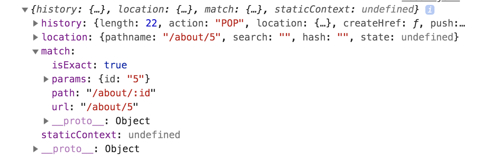

# React 5

Lecture Slides: https://slides.com/dmweb/react-five

Mini Project: https://github.com/DevMountain/react-4-mini

Afternoon Project: https://github.com/DevMountain/react-4-afternoon

## Student Learning Objectives

### Route

- Student can set up a Route to view a single component.
- Student can use path in a Route.
- Student can load a component when the path is matched.
- Student can use the word exact to prevent two Routes from loading their components at once.
- Student can set up a Route path using params.
- Student can access URL params through the props object.
- Student can nest Routes.

### Link

- Student can set up Link components to direct to matching Routes.
- Student can set up a Link component to direct to a Route with params in the path.

### Switch

- Student can set up a Switch component.
- Student can correctly order Routes in a Switch component to prevent one single Route from loading for two similar paths.

### Functional Components

- Student can use functional components
- Student can describe the difference between class based and functional components

# React 5 Lecture Notes

In this lecture we cover React Router and how to implement a routing system into our React applications.

Traditionally, when we wanted to create a website that uses multiple pages, we would need to make a request to a server to send back a specific html file to show in the browser. Everytime we would make a request it would cause our web page to reload and this can sometimes be very slow.

A great example of this is the New York Times webpage that can be found [here](https://www.nytimes.com/).

In modern day web development, libraries and frameworks such as React only use a single html file and allow us to create a single page application and prevents us from having to request new html files to display every time we want to route to another page.

So how do we create a single page application that allows us to have multiple pages?

In React, we can use a library called `React Router Dom` that will handle what is being displayed to the screen based on the URL.

This will allow us to create a multi page application effect, with the lightning fast speed of a single page application.

## React Router

The library that we will be using to implement a routing system into our React application is called `react-router-dom`. Go ahead and install it into your project by running the terminal command

```bash
$ npm install react-router-dom
```

### HashRouter

We will be using a specific router from react router called `HashRouter`.

Now that we have `react-router-dom` installed in our project, let's go ahead and setup the router. In `index.js` we will import HashRouter.

> Make sure to wrap it in curly braces!

```js
import { HashRouter } from 'react-router-dom'
```

Now since we have it imported, we want to wrap our entire application in it, so we will wrap the `HashRouter` component around our `App` component that is being rendered inside of `reactDOM.render()`.

```js
import React from 'react'
import ReactDOM from 'react-dom'
import App from './App'

// import HashRouter
import { HashRouter } from 'react-router-dom'

ReactDOM.render(
  // Wrap App with HashRouter
  <HashRouter>
    <App />
  </HashRouter>,
  document.getElementById('root')
)
```

The goal for Hash Router is to keep our user interface in sync with what ther URL is. Meaning, that will display specific components on what the URL in our browser is.

### Route

Route is the component we will use from `react-router-dom` to determine a specific route for what component will be displayed based on the URL.

We first need to import it into our file to use.

```js
import { Route } from 'react-router-dom'
```

> Make sure to use object destructuring!

We can now use `Route` inside of our JSX and give it specific props to determine what component is displayed based off of the URL path.

```js
<Route />
```

#### Path

The `path` prop will determine what the URL path should be to display the component.

```js
<Route path="/home" />
```

Above, we have determined that if the URL ends with '/home' then the Home component will be displayed.

#### Exact

Another prop that we can add to our Route is `exact`. This prop will tell the route that the URL needs to match up exactly with the path we defined on our Route.

```js
<Route exact path="/home" />
```

Above, we have declared the URL needs to end exactly with '/home'. If we have anything following or before the '/home' then the component will not be displayed.

This is extremely important to include if we want our base route to be displayed correctly. We can determine what our base route is by creating a route for '/'.

```js
// bad
<Route path='/' />

// good
<Route exact path='/' />
```

#### Component

The `component` prop is the prop we can add to determine what component is displayed.

```js
<Route component={Home} />
```

Above we are rendering a the Home component for this route. Make sure to include curly braces and the component name.

### Switch

Switch is another component that we can use from react router dom library to render only the first route that matches the URL.

If we had multiple routes like so

```js
<Route exact path='/' component={Home} />
<Route path='/about' component={About} />
<Route path='/about/contact' component={Contact} />
```

If we went to '/about/contact' we would still see the component that is being rendered at '/about' because the URL still matches. We could fix this including a bunch of `exact` props, or we could use `Switch`.

We can use `Switch` by wrapping all of our `Route` components inside of it. We need to make sure we also import Switch into our file

```js
import { Route, Switch } from 'react-router-dom'
```

> Remember to use the object destructuring!

Now once we have it imported, we can use it

```js
<Switch>
  <Route exact path="/" component={Home} />
  <Route path="/about" component={About} />
  <Route path="/about/contact" component={Contact} />
</Switch>
```

We need to make sure that our Routes are in order inside of our Switch, since it looks for the first route that matches the URL.

### Link

We can navigate to different routes inside of our application by using the `Link` component that comes from react-router-dom.

We first need to import the `Link` into our file

```js
import { Route, Switch, Link } from 'react-router-dom'
```

Then we will wrap whatever we want to click on to take us to the route.

```js
<Link>
  <p>Home</p>
</Link>
```

#### To

The `Link` component has a required prop called `to`. This is how we will tell what route the link should take us to.

```js
<Link to="/">
  <p>Home</p>
</Link>
```

Above we are now telling this `Link` tag to take us to the base route, which will render the Home component.

### Params

We can set `params` inside of our path by prefixing the part of the path with a colon. This will allow us to pass data to our path.

```js
<Route path="/users/:id" component={User} />
```

Above we are saying that whatever is passed to the '/:id' will be in our URL. We can link to it like so

```js
<Link to="/users/5">
  <p>User Profile</p>
</Link>
```

Above, we are passing the number 5 to the URL. We can access that data that is being sent through the URL from the `props.match.params` object.

```js
const { id } = props.match.params
```

or if we console logged `props`, the object would look like the following



# Additional Resources

## Docs

- https://reacttraining.com/react-router/web/guides/quick-start - The quickstart docs for implementing React Router on a React web app.

## Articles

- https://johnpapa.net/pageinspa/ - Article that provides a high level overview of what a Single Page Application actually is.

- https://medium.com/@NeotericEU/single-page-application-vs-multiple-page-application-2591588efe58 - Article that covers the pros and cons of using a Single Page Application versus a Multi Page Application.

- https://redux.js.org/advanced/usage-with-react-router/ - Redux docs that cover usage of Redux with React Router.

## Videos

- https://www.youtube.com/watch?v=Law7wfdg_ls - Solid tutorial video demonstrating how to implement React Router with BrowserRouter instead of HashRouter (very similar, and BrowserRouter would be more likely to be used in a production app)

- https://www.youtube.com/watch?v=XRfD8xIOroA - Another solid tutorial video demonstrating how to implement React Router with BrowserRouter instead of HashRouter (very similar, and BrowserRouter would be more likely to be used in a production app)
