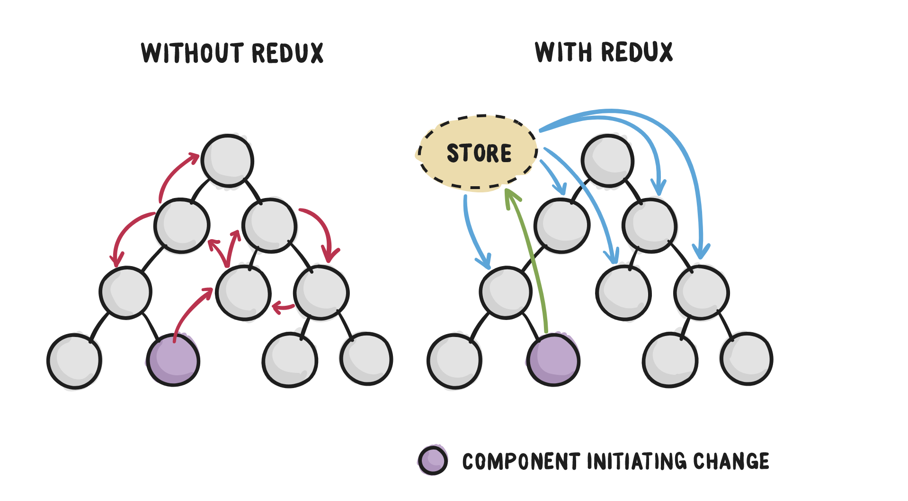
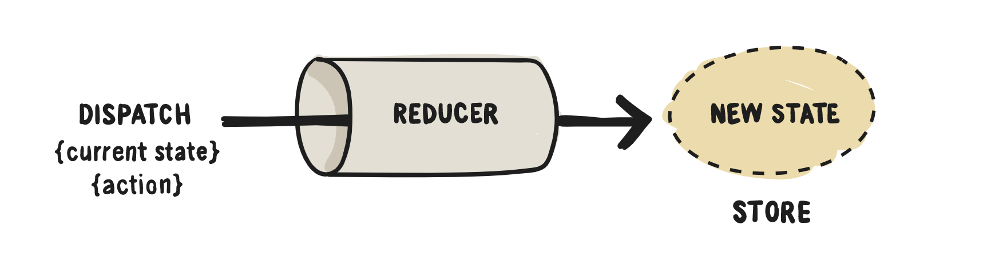
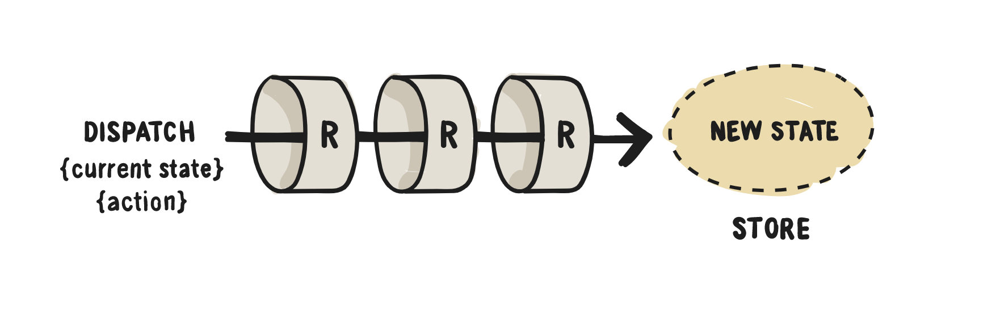

# React 6

Lecture Slides: https://slides.com/dmweb/redux-react-redux

Mini Project: https://github.com/DevMountain/redux-2-mini

Afternoon Project: https://github.com/DevMountain/redux-2-afternoon

## Student Learning Objectives

### Redux

- Student can describe the role of redux
- Student can describe the following vocab in the context of redux: Store, reducer, action, action creator, connect
- Student can describe when to use Redux

### Redux - Stores & Reducers

- Student can setup redux passing a store into a reducer
- Student can create a reducer
- Student can create and dispatch actions
- Student can inititalize default state in a reducer
- Student can update state in a reducer

## What is Redux?

Redux is a tool that was created by Dan Abromav that we can use to help manage the `state` for our application. It introduces something known as `application state` and will allow any component that `subscribes` to the `store` to access it.

### Redux Dataflow

In React, data flows unidirectionally. This means that we can only pass data from a parent to a child component. This can become a hassle and pretty complex when we start dealing with very large scaled applications.

Redux will introduce a `source of truth` and allow us to store our state in a single place called the `store` that any of our components can `subcribe` to, to gain access to state values directly instead of having to pass that data from component to component until it reaches the desired destination.

Components will then `dispatch` changes to the store to update the state values, and all of the other components that are `subscribed` to the store will recieve those state updates.



The key part of what makes Redux work is the `Reducer`.

### Reducer

In Redux, we will write a function that will handle all of the reductions made. This function will take in the current redux state object and an object that contains a set of instructions on how to update the state. Then it will return a new mashed object.

This functions is what is known as a `reducer` function.

The object with the set of instructions that the `reducer` receives is what we call an `action`. This `action` object will include a `type` and a `payload`.

```js
let action = {
  type: 'update_name',
  payload: 'Kyle',
}
```

The `type` will always be required for the action object so it knows exactly how we are updating the current state. Keep in mind that their can only be one type on the action object.

The `payload` will be the new value that we are adding to our state, or using to update an existing value.

Now let's take a look at the `reducer` function in action.

```js
function reducer(state, action) {
  switch (action.type) {
    case 'update_name':
      return Object.assign({}, state, { name: action.payload })
  }
}
```

Above we are receiving the current state and the set of instructions on how to update state (action) as arguments. Then we check to what type of action we have recieved and then execute the case inside the switch statement that matches the action type. It then returns a object that will be our updated state object.



This pattern that's using actions and reducer functions to update state is what makes up around 85% of redux.

Now you're probably asking "How do we implement this in React?". We will need to first create a `store` to and bring in all of our reducer functions into it.

### Action Creator

Instead of just using a normal `action` object, we will create a function that delivers that action object. This function will accept the payload as a parameter, then we will form an action object that will be returned from the function.

It will look something like this.

```js
function updateUser(payload) {
  // create action object
  const action = {
    type: 'UPDATE_USER',
    payload: payload,
  }
  // return action object
  return action
}
```

This will be a more efficient way to deliver that action object to our reducer.

### Store

The `store` is what holds the redux state tree for our application. The only way to change the values on this state is to `dispatch` an action to it.

We will create our store by passing our reducer into it.

```js
import { createStore } from 'redux'
import reducer from './reducer'
// this function creates the store and we pass our root reducer to it
export default createStore(reducer)
```

## React Redux

React Redux is the official binding for using redux in a react application. This means that the `react-redux` package was created, and is maintined by the react team, specifically for using react & redux together.

Why should we use this? It's because the `react-redux` package follows the main core principles of react much better than vanilla redux. Before we were throwing the redux state into the local state of the component, but that's not really best practice because we want to keep our local state specifically for values that should be local to our component and not for an outside state manager.

Props are what we use in react to reference state values that come from outside sources (other components) so it would make more sense for us to stick our redux values onto the `props` of the component rather than local state. react-redux does precisely this. When we subscribe to the redux store using the higher order component `connect` from react-redux, it will map that redux state to the props of the component.

### Setting Up

The first thing we need to do is to install the react-redux package. In the terminal of your project, run this command.

```bash
$ npm install react-redux redux
```

Once we have the package installed, we will need to setup our environment by creating our `reducer` and `store`. In the `src` folder, we will create a new folder called `redux` this is where we will house our redux functionality. Inside the `redux` folder we will create a reducer, go ahead a create the `user_reducer.js` file.

Inside of `user_reducer.js`, setup a basic reducer function. This reducer is where we will house the information for our user that will login.

```js
// Initial State
const initialState = {
  user: {},
}

// Action Types
const LOGIN_USER = 'LOGIN_USER'

// Action Creator
export function loginUser(user) {
  const action = {
    type: LOGIN_USER,
    payload: user,
  }

  return action
}

// Reducer Function
export default function userReducer(state = initialState, action) {
  switch (action.type) {
    case LOGIN_USER:
      return Object.assign({}, state, { user: action.payload })
    default:
      return state
  }
}
```

Now that we have made our basic reducer function, we need to create the `store`. Inside of the `redux` folder, create a `store.js` file to house our store.

```js
// import the store
import { createStore } from 'redux'
// import the reducer
import userReducer from './reducer'
// export the store being created
export default createStore(userReducer)
```

We now have the `store` and our `reducer` created. We will now implement them into our application using `react-redux`. Inside of the `index.js` we will wrap our application inside of the `Provider`.

The `provider` is a higher order component that will wrap our application and provide the redux store to our app. In `index.js` import the store that we created. Then we will import `Provider` from the `react-redux` package. We will then render `<Provider>` and wrap it around `<App />` in the `ReactDOM.render()` function.

Our app is now being wrapped by the redux environment from `react-redux`. Once we have rendered the provider, we will pass a prop to it called `store` and the value for that prop will be the store that we created.

```js
import React from 'react'
import ReactDOM from 'react-dom'
import App from './App'

// Redux Store
import store from './redux/store'

// import Provider
import { Provider } from 'react-redux'

ReactDOM.render(
  <Provider store={store}>
    <App />
  </Provider>,
  document.getElementById('root')
)
```

Now our application is setup and configured to use the redux environment that is provided from `react-redux` using our own store.

### Subscribing A Component

Now that we have redux setup, let's go ahead and get our component `subscribed` to the redux store. We will be using the `connect` HOC from `react-redux`. Go ahead and import `connect` at the top of the file.

```js
import React, { Component } from 'react'

// connect from react-redux
import { connect } from 'react-redux'

class App extends Component {
  render() {
    return <div></div>
  }
}

export default App
```

Then we will wrap our component inside of it when we export the component.

```js
import React, { Component } from 'react'
import { connect } from 'react-redux'

class App extends Component {
  render() {
    return <div></div>
  }
}

// wrap the app in the connect HOC
export default connect()(App)
```

This looks a little weird right? It's because we still have some more setup to do. `connect` is expecting a callback function that will return an object with the state values from redux that we want to add to the props object of the App component.

We will create a function that will establish that object, and then pass the function into `connect` as an argument.

```js
import React, { Component } from 'react'
import { connect } from 'react-redux'

class App extends Component {
  render() {
    return <div></div>
  }
}

// function that will map redux state to the components props
const mapStateToProps = state => state

export default connect(mapStateToProps)(App)
```

We now have mapped the redux state values onto the `props` of the component. If you console.log(this.props), you should see the values from redux on the props object of App.

However, what if we want to `dispatch` an action to our redux store? We will need to first import the `action creators` into our file from the reducer.

```js
import React, { Component } from 'react'
import { connect } from 'react-redux'

// import the action creators from the reducer to use
import { loginUser } from './redux/reducer'

class App extends Component {
  render() {
    return <div></div>
  }
}

const mapStateToProps = state => state

export default connect(mapStateToProps)(App)
```

Once we have the action creators imported, we will need to create an object that contains our action creators inside. This object will be passed to `connect` as the second argument, to correctly map our action creators or "dispatchers" to the props of the component.

```js
import React, { Component } from 'react'
import { connect } from 'react-redux'

import { loginUser } from './redux/reducer'

class App extends Component {
  render() {
    return <div></div>
  }
}

const mapStateToProps = state => state

// We now pass in an object containing the dispatchers as the second argument to map them to props
export default connect(mapStateToProps, { loginUser })(App)
```

Now when we want to dispatch a specifc action to the redux store we will invoke that action creator function.

```js
this.props.loginUser({ id: 1, name: 'tayte' })
```

We now have full access to read and manipulate the redux store from our component through subscribing using `connect`.

## Redux Promise Middleware

Now when we are wanting to make some sort of `asynchronous` action inside of our `action creators`, we need to configure our store to allow it to happen.

We will need to use a package called `redux-promise-middleware`, so go ahead an install that package using your terminal.

```bash
$ npm install redux-promise-middleware
```

Now inside of `store.js` we will need to import that package. We also import `applyMiddleware` from 'redux`so we can apply the promise middleware. Then we will pass the applyMiddleware function being invoked into`createStore` as a second argmuent, and pass the promiseMiddlware into the function.

```js
// import the store and apply middleware
import { createStore, applyMiddleware } from 'redux'
import userReducer from './reducer'
// import promise middleware
import promiseMiddleware from 'redux-promise-middleware'
export default createStore(userReducer, applyMiddleware(promiseMiddleware))
```

We have now setup our redux store to allow asynch actions. Now let's set an action creator to get a random user from the

In the reducer, make this.

```js
export function getRandomUser() {
  const randomUser = axios
    .get('https://randomuser.me/api/')
    .then(res => res.data.results[0])

  const action = {
    type: GET_USER,
    payload: randomUser,
  }

  return action
}
```

Now once we have this `action creator` created, we need to add a case to our reducer function to handle it. When we make an `http` request, thatr request will go into different stages, `pending`, `fulfilled`, and `rejected`. We can set up cases in our reducer function that will perform some logic for each one of those stages

```js
import axios from 'axios'

// Initial State
const initialState = {
  user: {},
  loading: false,
  errorMessage: '',
}

// Action Types
const GET_USER = 'GET_USER'

// Action Creator
export function getRandomUser() {
  const randomUser = axios
    .get('https://randomuser.me/api/')
    .then(res => res.data.results[0])
    .catch(error => error.message)

  const action = {
    type: GET_USER,
    payload: randomUser,
  }

  return action
}

// Reducer Function
export default function userReducer(state = initialState, action) {
  switch (action.type) {
    case GET_USER + '_PENDING':
      return Object.assign({}, state, { laoding: true })
    case GET_USER + '_FULFILLED':
      return Object.assign({}, state, { user: action.payload, loading: false })
    case GET_USER + '_REJECTED':
      return Object.assign({}, state, { errorMessage: action.payload })
    default:
      return state
  }
}
```

## Multiple Reducers

When our applications start to grow, it can be nice to use multiple reducers to help create organization within our code. We can use the `combineReducers` function from `redux` to combine our multiple reducers into a single `rootReducer`.



In `store.js` we will import `combineReducers` from `redux`. Then we will create a root reducer by invoking the combineReducers function, and pass in an object with all of our reducers (in this case I only have one, so we are preparing for the future). Then we will pass the root reducer in as an argument to our `createStore` function.

```js
// Bring combine reducers
import { createStore, applyMiddleware, combineReducers } from 'redux'
import userReducer from './reducer'
import promiseMiddleware from 'redux-promise-middleware'

// Create the root reducer
const rootReducer = combineReducers({
  userReducer,
})

// Pass in the root reducer
export default createStore(rootReducer, applyMiddleware(promiseMiddleware))
```

> Note: Keep in mind that this will add another layer to how we access the reducers states in our components

# React 6 Mini Project

https://github.com/DevMountain/redux-2-mini

# React 6 Afternoon Project

https://github.com/DevMountain/redux-2-afternoon

# Additional Resources

### Videos

https://www.youtube.com/watch?v=CVpUuw9XSjY - simple, 30min video tutorial on implementing Redux with React

### Courses

https://egghead.io/courses/getting-started-with-redux - A 2 hour course from the inventor of the Redux pattern himself

### Articles

- https://css-tricks.com/learning-react-redux/ - comprehensive article-tutorial on learning React Redux
- http://wrschneider.github.io/2017/01/17/dont-redux-all-the-things.html - concise article detailing why Redux isn't the appropriate solution for every situation

- https://www.sohamkamani.com/blog/2017/03/31/react-redux-connect-explained/ — the connect method explained

### Docs

- https://redux.js.org/ — The official redux docs
- https://react-redux.js.org/ — The official react redux docs

### Other

- https://egghead.io/react-redux-cheatsheets — React and Redux cheatsheets

#### Related

- https://reactkungfu.com/2015/08/pros-and-cons-of-using-immutability-with-react-js/ — article comprehensively covering pros and cons of using immutability with React
- https://medium.com/@sharifsbeat/the-power-of-immutability-and-react-daf46f2a5f4d — an article comprehensively covering the power utilizing immutability in React
