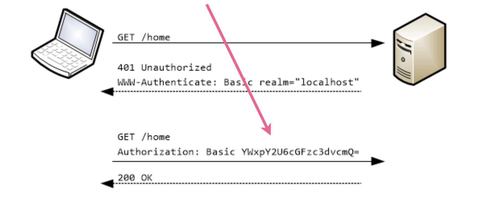
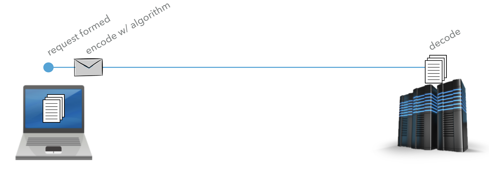
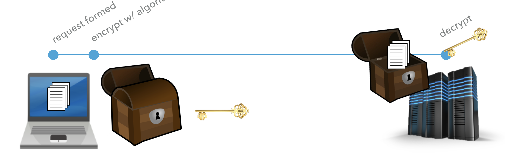
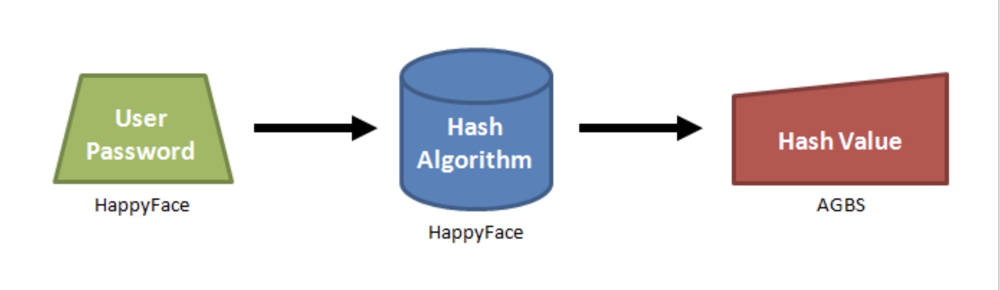
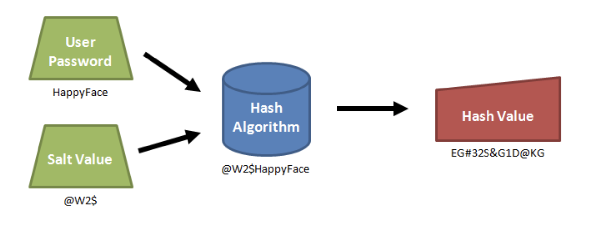

# Node Four

Lecture Slides: https://slides.com/dmweb/sessions-cookies-authentication

Mini Project: https://github.com/DevMountain/node-bcrypt-mini

Afternoon Project: https://github.com/DevMountain/node-bcrypt-afternoon

## Student Learning Objectives

### Custom/Application Level Middleware

- Student can create custom middleware.
- Student can put middleware in a separate file and import it into their server file to use.
- Student can invoke `next` in custom middleware.
- Student can implement custom middleware in `app.use()`.
- Student can implement custom middleware(s) directly in the endpoint.
- Student can implement custom middleware at different levels in the server file affecting only the desired endpoints below it.
- Student can serve up static files with `app.use(express.static( [file path to build folder] ))`.

### Sessions

- Student can install and require `express-session`.
- Student can create session middleware and pass in the options object with the properties `resave` (false), `saveUnitialized`(true) and `secret`.
- Student can assign the `secret` property a value from their `.env` file.
- Student can set an expiration for their session with the property `cookie.maxAge`.
- Student can store information on the session object through `req.session`.
- Student can access information on the session object through `req.session`.
- Student can destroy a session with `req.session.destroy()`.

### Authentication

- Student can discuss basics of web based authentication.
- Student can use bcrypt to hash and store passwords.
- Student can use bcrypt to authenticate users.
- Student can describe the differences between Hashing, Encryption and Encoding.

# Node 4 Lecture Notes

## Middleware

A middleware function is a function that is executed between an endpoint being hit and the handler function that sends a response. They will act like the `middle man` in our requests.

A middleware function expects three arguments, `req`, `res`, and `next`.

```js
function middleware(req, res, next) {}
```

`req` - This is the object of the request, we can use this to access data such as the body, params, and query.

`res` - This is the response object for the request, we can use this to send bacl data.

`next` - This is a function that we will need to invoke to move onto the function.

### Top Level Middleware

Top level middleware is a middleware function that is executed upon each request made to our server.

We can create a top level middlware function by passing the function into `app.use()`. It's important to make sure that these are around the top of the server so they are hit before the endpoints.

```js
app.use((req, res, next) => {
  console.log('custom tlm hit!')
  // invoke next to move onto the next funciton in the req
  next()
})
```

In the example above we are just passing in an annonymous function, however we can declare that function elsewhere and pass it in.

We can pass an optional path as an argument to our `app.use()` function to specify what end points to use the midleware function on.

```js
app.use('/api/users', (req, res, next) => {
  console.log('user route hit!')
  next()
})
```

### Request Level

On an endpoint we can setup a middlware function that is only invoked when a specific enpoint is hit. This is referred to as `request level middleware`.

We can chain multiple request level middleware functions onto an endpoint before we hit the handler function. This works just like the TLM function that we wrote above. The RLM function will take in `req`, `res`, and `next` as arguments.

```js
app.get(
  '/api/test',
  function(req, res, next) {
    console.log('callback one')
    next()
  },
  function(req, res, next) {
    console.log('callback two')
    next()
  },
  function(req, res) {
    console.log('callback three')
    res.send('Send a response!')
  }
)
```

Above we have two RLM functions being executed before we hit our handler function and send b ack a response to our front end.

These middleware functions are great because we can use it to check for specific conditions to allow a user to keep moving on in the end point. A great example of this is setting up a middleware function to authenticate a user to login.

```js
// Dummy Data
let user = {
  username: 'tayte123',
  password: 'password123',
  full_name: 'Tayte Stokes',
  color: 'black',
}

// Custom Middleware Functions
const authenticateUser = (req, res, next) => {
  const { username, password } = req.body
  if (username === user.username && password === user.password) {
    // if username and password matches
    // invoke next and pass in the user and move onto the next function in the end point
    next()
  } else {
    res.status(403).send('Invalid username or password')
  }
}

// End Point to login
app.post('/api/login', authenticateUser, (req, res) => {
  // send back user object
  res.status(200).send(user)
})
```

## Cookies

A `cookie` is a small little file that will be stored onto your browser with some information. These are very small and are limited to 4kb of data.

HTTP requests are `stateless` meaning they do not remember data from previous requests. In this case, if we wanted to log our user in, they would need to send their login information upon every request so we know who they are. This is terrible for a website and we don't want to have it like this.

How do we get around this so we can just send our data one time and be remembered? We will create a `session` to keep track of their data by using a `cookie`.

### Session

Imagine that you go to a cafe to order a drink and then next week you back, the workers will most likely not remember you or what your ordered so you'll have to reorder. But what if they created a system where you can save your order based off of your personal ID, so now when you go to the cafe you just give them your id and they remember everything else about your order.

- The personal ID is the cookie in your browser storing your order

- The cafe is the server

- The information keeping track of your id and others id will be the session

We will be using a library called `express-session` to create the session store. Then we will use middleware to create a session for the user in our server and send back a `cookie` that will be stored to the browser with a `session id`.


Go ahead and install the library in our project by running the terminal command

```bash
$ npm install express-session
```

Then we will require it at the top of the file

```js
const session = require('express-session')
```

Then we will be using this as Top Level Middleware

```js
app.use(
  session({
    resave: false,
    saveUninitialized: true,
    secret: process.env.SESSION_SECRET,
    cookie: { maxAge: 60000 },
  })
)
```

The object that we passed in is known as the `configuration` object. We will configure the `resave`, `saveUninitialized`, and `secret`.

`secret` - This will be a random string to keep our session secret. This will ensure intregity of the cookie.

`saveUninitialized` - This will say when a session is created and no data is changed or added if we still want to save it to the store. Set it to true by default.

`resave` - This means that if nothing on the session was changed or modified do we want to save it to the store. Set it to false by default.

`cookie` - This will be an object that we can set an expiration in milliseconds to the cookie session.

We can now access any information from the session on the `req.session` object. We can put any information that we want to on to the session.

```js
const express = require('express')
const cors = require('cors')
const session = require('express-session')

app.use(express.json())
app.use(cors())
app.use(
  session({
    resave: false,
    saveUninitialized: true,
    secret: 'keyboard cat yo',
    cookie: { maxAge: 60000 },
  })
)

let user = {
  username: 'tayte123',
  password: 'password123',
  full_name: 'Tayte Stokes',
  color: 'black',
}

const authenticateUser = (req, res, next) => {
  const { username, password } = req.body
  if (username === user.username && password === user.password) {
    req.session.user = user
    next()
  } else {
    res.status(403).send('Invalid username or password')
  }
}

app.post('/api/login', authenticateUser, (req, res) => {
  console.log(req.session)
  res.status(200).send(user)
})

app.listen(8080, () => {
  console.log('Server Running!')
})
```

### Destroying A Session

We can destroy a server session by using the built in `destroy` method from the session.

```js
app.get('/api/logout' (req, res) => {
    req.session.destroy();
    res.status(200).send('user has been logged out');
});
```

## Authentication

`Authentication` is the process of verifying that an individual, entity, or website are who they say they are.

When authenticating users in a web application, it's common practice to require some sort of username or email and password. Passwords are information that only the owner of the password should know so it's important we keep that data safe and secure.

### Why Authentication?

There are many different reasons why we would setup an authentication process in our applications. We will use it whenever we want to create a unique experience for the user based off of their own personal information, whenever our servers need to know exactly who is accessing that data because different users will have different permissions to what data they can access. We also need to protect the user information.

There are two ways that we can go about setting up `authentication` into our web applications.

### Basic Authentication Built Into HTTP

Basic authentication is an authentication scheme that's built into http requests. This is a very simple way to set access restrictions for specific web resources.

Credentials are `encoded` and sent through the header of the http request.



`encoding` is where we transform data into another format using a publicly available scheme and is easily reversible. All you need to decode the encoding is by using the algorithim used to encode it.



Basic authentication provides no confidentiality to the transmitted credentials, so if someone were to intercept the transmitted data, it would be insanely easy to decode.

This is great for sending API keys for example.

### Form Based Authentication

This is the most common form of authentication that you will see over the web. This is where a user will enter their credentials into a form on your site and those credentials will be sent through the `body` of the request.

Anytime we are sending personal data like credentials or payment information, we want to make sure the info is being sent over with an `https` request.

We need make sure we are using `https` with basic and form authentication. Https will provide `encryption` to our request.

`Encryption` will transform the data being sent with the goal of keeping things secret.

The data being sent will be encrypted with an ecryption algorithim and will be provided a key. This will transform the data into `ciphertext`.

Ciphertext can only be decrypted with the encryption algorithim and the key.



Encryption is great for end to end messaging.

Now what do we do when we recieve that information on our server?

- We DO NOT store plain passwords in the database

- We DO NOT store encoded passwords in the database

- We DO NOT store encypted passwords in the database

We need to add another level of complexity by `hashing` the password before storing it.

### Hashing

Hashing is another way that we can protect data. We will `hash` user passwords before storing them.

Hashed passwords will become a random string of characters that are intended to never be un-hashed.



A hash is pretty much impossible to reverse enginer and un-hash. This provides another very strong layer of security.

We will be storing the `hashed` passwords into our database.

When we recieve the same input from a user and run the same hash algorithm on it, we will receive that same hash value so we can use that hash value to find the stored hash value in our db.

#### Salt

When we are hashing our passwords, we also want to add a `salt`. This will add some more complexity to the security layer to create an even more secure way to store passwords.

The salt is just another set of characters that are completely random that will make the hashed string even more secure.



### Bcrypt

We will be using `bcrypt` to generate the hashed and salted passwords. Bcrypt is an awesome library that we can use to increase the security in our applications.

#### Create A Hashed Password

Below is an example to create a hashed and salted password

```js
// Require bcrypt
const bcrypt = require('bcryptjs')
// Unhashed password
let password = 'thisisapassword'
// Create a salt
let salt = bcrypt.genSaltSync(15)
// Create a hash with the password and salt
let hash = bcrypt.hashSync(password, salt)
// Store hash into db
```

#### Reading A Hashed Password

Below is an example to compare a password to a hashed password

```js
// Require bcrypt
const bcrypt = require('bcryptjs')
// Unhashed password
let password = 'thisisapassword'
// Load hashed password from db
let hashedPassword = db.get_password()
// compare the password and hashedPassword
let authenticated = bcrypt.compareSync(password, hashedPassword) // this will return true or false
// use the authenticated variable to check if user is logged in successfully
```

# Node 4 Mini Project

https://github.com/DevMountain/node-bcrypt-mini

# Node 4 Afternoon Project

https://github.com/DevMountain/node-bcrypt-afternoon

# Node 4 Additional Resources

## Authentication

- [bcryptjs docs](https://www.npmjs.com/package/bcryptjs)
- [good video on hashing, encrypting, salt, and bcrypt](https://www.youtube.com/watch?v=cczlpiiu42M)

### Middleware

- A brief summary of middleware: https://developer.mozilla.org/en-US/docs/Glossary/Middleware
- A more in-depth explanation of middleware: https://www.redhat.com/en/topics/middleware/what-is-middleware

### Cookies

- In-depth history and explanation of cookies:https://www.whoishostingthis.com/resources/cookies-guide/
- Another in-depth guide to cookies: https://html.com/resources/cookies-ultimate-guide/
- A very accessible explanation of cookies from the pre-class videos: https://www.youtube.com/watch?v=I01XMRo2ESg
- Another overview of cookies as well as sessions using Starbucks analogy: https://www.youtube.com/watch?v=64veb6tKTm0

## Sessions

- Brief overview of sessions : https://stackoverflow.com/questions/53918615/understanding-express-session
- Basic example of how to use express sessions and why they are useful: https://www.tutorialspoint.com/expressjs/expressjs_sessions.htm
- Another example and explantion of express sessions: https://flaviocopes.com/express-sessions/
