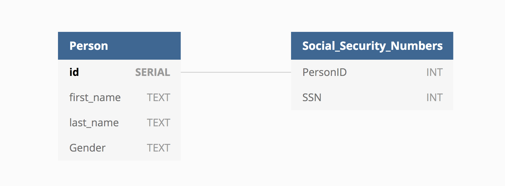
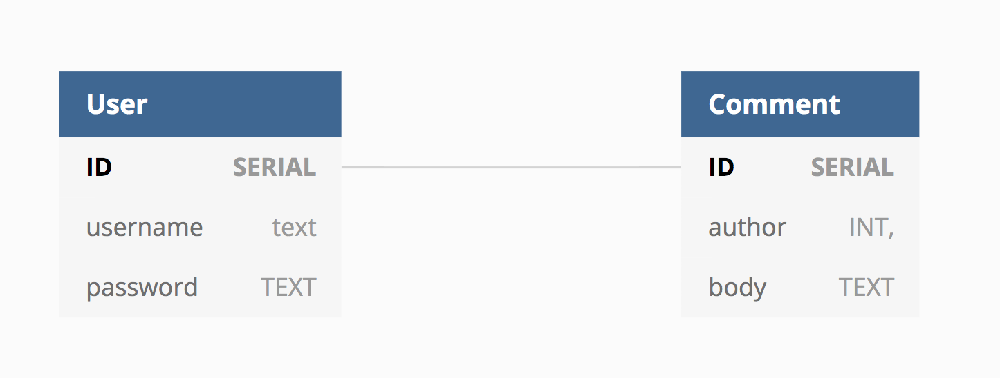
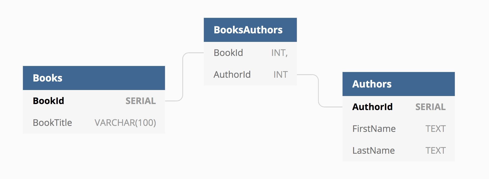

# SQL Two

In this lecture we go over a review of the last SQL lecture, introduce table relationships, set up tables with primary and foreign key relationships, review how to alter tables, and other advanced SQL topics including subqueries and aliasing.

Lecture Slides: https://slides.com/dmweb/copy-of-sql-2

Mini Project: https://github.com/DevMountain/sql-2-mini

Afternoon Project: https://github.com/DevMountain/sql-2-afternoon

> NOTE: Both the mini and afternoon projects will be completed on https://postgres.devmountain.com
>
> Students should comment their queries as they go and then send them to their mentor over slack upon completion.

## Student Learning Objectives

- Students can use the `alter` keyword to add columns to database tables
- Students can use the `alter` keyword to change column data types in database tables
- Students can use the `alter` keyword to rename columns in database tables
- Students can use the `alter` keyword to remove columns from database tables
- Students can use the `alter` keyword to change the name of database tables
- Students can use the `alter` keyword to change the name of database tables
- Students can use the `drop` keyword to delete a database table
- Students understand `relational` databases and the importance of relationships between different database tables
- Students understand a one-to-one table relationship
- Students understand a one-to-many table relationship
- Students understand a many-to-many table relationship
- Students understand and can explain the importance of using foreign keys in database tables
- Students understand the importance of using a join table in a many-to-many relationship
- Students can use a `join` statement to select data from multiple joined database tables
- Students can use table name aliases as part of SQL statements
- Students understand and can use a `subquery` in place of a `join` statement to select data from multiple database tables

# SQL 1 Lecture Content Review

<details>
<summary> Database Schemas </summary>
<br/>
The `schema` is the blueprint for how our tables are structured. This is what sets the guidelines for how the data is stored inside of our database.

A schema for our table above would look similar to this

```sql
CREATE TABLE racers (
    racerId SERIAL PRIMARY KEY,
    name TEXT,
    age INTEGER,
    country TEXT
)
```

Above, we are determining exactly what data types are allowed to be inserted into each column for the row that is being added to our racers table in our database.

</details>

<details>
<summary> Data Types</summary>
<br/>
When setting up our schema we will determine what `data type` is allowed in our columns. There are many types out there, but we will cover the main ones.

### Empty Values

`Null` - This data type means an empty value

### Numeric Values

`Integer` - This data type will define a round number

`Decimal` - This data type can have unlimited decimal values

`Float` - This data type can have values up to 15 decimal places

`Serial` - This data type is an automatic incrementing integer, usually used with primary keys to establish uniqueness. This value is automatically assigned when a new row of data is created in the table.

### Character Values

`Text` - This data type declares unlimited characters in a string

`Varchar(n)` - This data type will allow you to determine how many characters are allowed

### Boolean Values

`Boolean` - This data type is either true or false

</details>

<details>
<summary> SQL Functions </summary>
<br/>

There are "functions" that we can use with PostgreSQL. This will usually handle some sort of mathematical logic for us.

`count()` - This returns the count of an expression.

```sql
SELECT count(id)
FROM racers
```

> It's important to note that count does not count null values. Pass in the `*` to account for all rows.

`min()` - This returns the minimum value of an expression.

```sql
SELECT min(age)
FROM racers
```

Above, we are finding the youngest racer.

`max()` - This returns the maximum value of an expression.

```sql
SELECT max(age)
FROM racers
```

Above, we are returning the oldest racer.

`sum()` - This returns the summed value of an expression.

```sql
SELECT sum(age)
FROM racers
```

Above, we now have the sum of the ages for all the racers.

`avg()` - This function returns the average value of an expression.

```sql
SELECT avg(age)
FROM racers
```

Above, we have found the average age of the racers.

</details>

<details>
<summary> SQL Statements</summary>
<br/>
SQL statements are queries that we make to our database.

A few things to note about SQL Statements:

1. We use a semicolon to declare the end of a statement

2. We can not have a trailing comma on our scripts

3. We need to use single quotes, not double quotes

4. It's common to use all caps, but it's not needed. It's best to stick with one way and be consistent and not use lowercase and capital characters.

### Common Statements

<details>
<summary> Select Statement</summary>
<br/>
Select statements are used to query our database for information. The structure for a `select` statement looks like the following.

```sql
SELECT *
FROM racers
```

Above, we declare it's a select statement using the `SELECT` keyword. It is followed by the column name that we want to select data from. In this case, we used an asterisk to say 'all' the data from every column. Then we declare what table to select from using the `FROM` keyword.

Other SQL keywords that are commonly used in `select` statements include `where`, `limit`, and `order by`.

<details open>
<summary> WHERE</summary>
<br/>
We can use a `where clause` to add a filter to our select statements.

```sql
SELECT *
FROM racers
WHERE name = 'Matt'
```

This `where clause` can use a number of different operators and conditional keywords to further filter the data returned as part of the `select` statement

<details>
<summary> Comparison Operators</summary>
<br/>

`>` - Greater than.

```sql
SELECT *
FROM racers
WHERE id > 2
```

`<` - Less than.

```sql
SELECT *
FROM racers
WHERE id < 2
```

`>=` - Greater than or equal to.

```sql
SELECT *
FROM racers
WHERE id >= 2
```

`<=` - Less than or equal to.

```sql
SELECT *
FROM racers
WHERE id <= 2
```

`!=` - Does not equate.

```sql
SELECT *
FROM racers
WHERE id != 2
```

</details>

<details>
<summary> Logical Operators</summary>
<br/>
`AND` - Check for multiple conditions to be true.

```sql
SELECT *
FROM racers
WHERE id != 2
AND id < 3
```

`OR` - Check for only one of multiple conditions to be true.

```sql
SELECT *
FROM racers
WHERE name = 'Matt'
OR id = 2
```

</details>

<details>
<summary> Null and Not Null</summary>
<br/>
`IS NULL` - Checks for a value to be null.

```sql
SELECT *
FROM racers
WHERE name IS NULL
```

`IS NOT NULL` - Checks for a value NOT to be null.

```sql
SELECT *
FROM racers
WHERE name IS NOT NULL
```

</details>

<details>
<summary> IN Condition</summary>
<br/>
`IN` - This is used as shorthand syntax to act as multiple `OR` conditions.

```sql
SELECT *
FROM racers
WHERE name IN ('Matt', 'Andrew', 'Lucas');
```

If we didn't use the `IN` keyword, our statement would look like this

```sql
SELECT *
FROM racers
WHERE name = 'Matt'
OR name = 'Andrew'
OR name = 'Lucas';
```

</details>

<details>
<summary> BETWEEN Condition</summary>
<br/>
`BETWEEN` - This is used to retrieve values in between a range.

```sql
SELECT *
FROM racers
WHERE id BETWEEN 1 AND 3;
```

</details>
</details>

<details>
<summary> LIMIT</summary>
<br/>

The `LIMIT` clause will allow you to return a certain amount of rows from a select statement.

```sql
SELECT *
FROM racers
LIMIT 2
```

This would return the first two rows of data from the racers table.

</details>

<details>
<summary> ORDER BY</summary>
<br/>

`ORDER BY` - This clause will sort the records in our result. This clause can only be used in select statements.

```sql
SELECT *
FROM racers
ORDER BY id
```

This will organize our result in ascending order by default.

##### ASC

`ASC` is the keyword we can use with order by to sort our records in the result in ascending order.

```sql
SELECT *
FROM racers
ORDER BY id ASC
```

##### DESC

`DESC` is the keyword we can use with order by to sort our records in the result in descending order.

```sql
SELECT *
FROM racers
ORDER BY id DESC
```

</details>
</details>

<details>
<summary> Insert Statement</summary>
<br/>
We can use `insert statements` to add data into our tables. The syntax for an insert statement looks like the following.

```sql
INSERT INTO racers
(name, age, country)
VALUES
('Matt', 27, 'US')
```

Above, we are adding a racer `Matt` into the database. We first declare a insert statement with the `INSERT INTO` keyword followed by the name of the table we are inserting data into. In parenthesis, we select the columns to add to. Use the `VALUES` keyword followed by another pair of parenthesis to include the data to insert into the columns.

> Note: It's important that the data lines up with the column we want to insert that data into

</details>

<details>
<summary> Update Statements</summary>
<br/>
We can update our data inside of a database by using an `update` statement.

```sql
UPDATE racers
SET name = 'Scott'
WHERE id = 2
```

Above, we have just updated the name for the user with the id of 2. We first use the `UPDATE` keyword followed by the name of the table we are updating. Then we `SET` the name to "Scott" where the user id equals 2.

</details>

<details>
<summary> Delete Statements</summary>
<br/>
We can remove or destroy data from our database by using a `delete` statement.

```sql
DELETE FROM racers
WHERE id = 2
```

We first use the `DELETE FROM` keyword, then declare the table to remove from. We then choose the id of the racer we want to remove.

> Make sure to add the where clause or you would remove everything in the table!

</details>
</details>

# SQL 2 Lecture Content

## Altering Tables

We can use `alter` statements to alter our tables in our database. We generally use alter statements to modify the `schema` for our tables.

### Adding Columns

```sql
ALTER TABLE racers
ADD COLUMN team TEXT
```

### Alter Column Data Types

```sql
ALTER TABLE racers
ALTER COLUMN team
SET DATA TYPE VARCHAR(100);
```

We can also make this shorter by using `shorthand syntax`. This way is shorter from the previous example.

```sql
ALTER TABLE racers
ALTER team
SET DATA TYPE VARCHAR(100);
```

This way is the shortest syntax we can use.

```sql
ALTER TABLE racers
ALTER team
TYPE VARCHAR(100);
```

### Renaming Columns

```sql
ALTER TABLE racers
RENAME COLUMN team
TO "group";
```

### Remove Columns

```sql
ALTER TABLE racers
DROP COLUMN group;
```

### Change Table Name

```sql
ALTER TABLE racers
RENAME TO bike_racers;
```

## Dropping A Table

We can drop our tables, if we feel the need to remove them. Be careful doing this, because we can not restore tables that have been dropped. This could lead to a lot of problems, so just keep that in mind!

```sql
DROP TABLE racers
```

## Distinct

`DISTINCT` is the keyword we can use when we don't want any duplications in datasets

```sql
SELECT DISTINCT country FROM racers;
```

## Table Relationships

A relational database is built around a model of having `relationships` between different tables to establish a way for the tables to communicate with each other.

There are three main designs that we can establish for creating a `relationship` between tables.

### One to One

This design is where one entity can only talk to one other entity. I like to think about this like a social security number. Only one person will be associated with one SSN, it will never represent more than one person.



### One to Many

This design is where one entity can have multple relationships with other entities. I like to think about this like comments on a website. A comment is only owned by one person, this creates a `one to many` relationship. One user can have many comments.



### Many to Many

This design is where multiple entities can have a relationship with multiple entities. I like to think about this as books and authors. A book can have many authors and an author can have many books.



## Foreign Keys

Now that we have talked about some of the relational design patterns, you are probably wondering how we actually set this relationship up? This is where `foreign keys` come into play.

A `foreign key` will set a constraint to the data that is inserted into the row. The only way data can be inserted is if a row has a column value that matches with another specific value from another table.

A `foreign key` will typically reference a `primary key` from another table.

```sql
CREATE TABLE bikes (
  bikeId SERIAL PRIMARY KEY,
  racerId INTEGER REFERENCES racers(racerId),
  type TEXT,
  color TEXT
)
```

Above is the syntax we would use to setup a foreign key in our schema for a table. We are saying that the `racer_id` column needs to have a matching value with a row's id from the racers table. This has now created that `relationship` between the two tables.

## Join Statements

`Joins` are one of the essential elements that help make up a relational database.

They will allow us to retrieve data from multiple tables at one time.

```sql
SELECT *
FROM racers
JOIN bikes ON racers.racerId = bikes.bikeId;
```

Above is the basic syntax for creating a `join` statement. We first will use a `select` statement to choose what columns we want to select data for from both of the tables, then we select the first table and the second table. We use the `ON` keyword to connect both of the tables on their primary and foreign keys.

## Aliasing

Aliasing can make our queries and statements a little more organized and easier to understand.

`AS` is the keyword we will use to alias how we refer to something. The alias name will follow the keyword.

```sql
SELECT name AS firstName
FROM racers
```

Above, we alias the `name` column as `firstName`. This can become handy when we have multiple tables with the same name for some columns.

## Subqueries

A `subquery` is a query that is nested inside of another larger query.

a subquery can be nested inside a `SELECT`, `INSERT`, `UPDATE`, `DELETE`, or `SET` statement or inside another subquery.

A subqeury is usually added within the `where` clause of a statement.

It's important to keep in mind that the most inner query will be executed before the outer queries.

```sql
SELECT *
FROM racers
WHERE racerid IN (
	SELECT racerid
  FROM bikes
  WHERE type = 'fezzari'
  AND age >= 25
)
```

# Additional Resources

- https://www.postgresql.org/docs/ - The official docs of PostgreSQL. These are a comprehensive resource on everything PostgreSQL
- http://www.postgresqltutorial.com/ - These are more user-friendly and accessible guides on using PostgreSQL. Highly encourage beginners to look here.
- https://www.youtube.com/watch?v=qw--VYLpxG4 - Although this is a very long tutorial(4hrs and 20mins) for learning PostgreSQL from freeCodeCamp.org, it is much more comprehensive than the material covered in these lecture notes and provides a baseline for practicing more advanced features included in the PostgreSQL querying language
- Database Diagram Design Tools
  1. https://dbdiagram.io/home - Useful design tool that produces SQL code for you based on the diagrams you create.
     > Note: Even when you specify that the software produced code should be formatted in PostgreSQL, you should **NOT** trust that it is entirely syntactically correct.
  2. https://draw.io - A very basic, but free diagramming tool. Can be used for wireframing or creating charts/diagrams beyond database tables.
  3. https://lucidchart.com - A more elegant and feature-rich collaborative diagramming tool.
     > Note: The free plan is limited to 3 diagrams and 60 objects per diagram.

# SQL 2 Mini Project

https://github.com/DevMountain/sql-2-mini

# SQL 2 Afternoon Project

https://github.com/DevMountain/sql-2-afternoon
